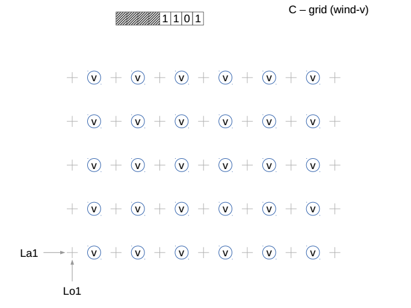
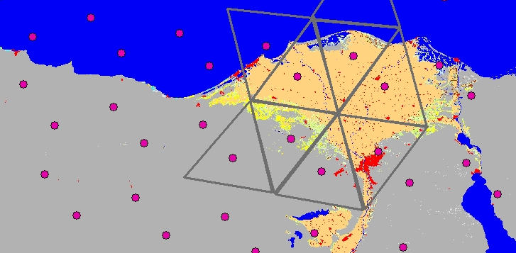

ATTACHMENT II

ARAKAWA GRIDS

Arakawa grids were first described in Arakawa and Lamb (1977).footnote:[Arakawa, A. and V.R. Lamb, 1977: Computational design of the basic dynamical processes of the UCLA general circulation model. _Methods of Computational Physics_ 17__,__ New York: Academic Press, pp. 173–265.] There are several different grids with unique staggers labelled as A, B, C, D and E. The following examples show how many of these grids can be defined in GRIB2 using grid definition template 3.1 along with bits 5 through 8 of Flag table 3.4. The relevant bit settings are noted where applicable.

** +
**image:../adoc/extracted-media/media/image1.png[image,width=623,height=487]image:../adoc/extracted-media/media/image2.png[image,width=623,height=462]** +
**image:../adoc/extracted-media/media/image3.png[image,width=623,height=464]image:../adoc/extracted-media/media/image4.png[image,width=623,height=466]** +
**image:../adoc/extracted-media/media/image5.png[image,width=623,height=467]image:../adoc/extracted-media/media/image6.png[image,width=623,height=469]** +
**image:../adoc/extracted-media/media/image7.png[image,width=623,height=495]** +
**image:../adoc/extracted-media/media/image9.png[image,width=623,height=472]image:../adoc/extracted-media/media/image10.png[image,width=623,height=495]** +
**image:../adoc/extracted-media/media/image11.png[image,width=623,height=452]image:../adoc/extracted-media/media/image12.png[image,width=623,height=442]** +
**
