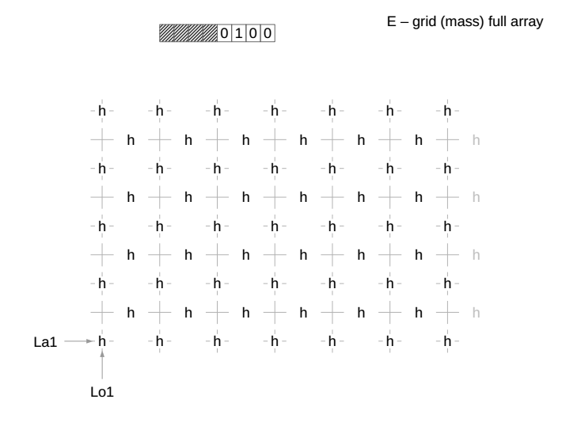
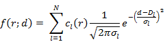

== Manual on Codes

=== International Codes 

=== Volume I.2

Annex II to the WMO Technical Regulations

Part B – Binary Codes

Part C – Common Features to Binary and Alphanumeric Codes

2015 edition

Updated in 2018

image:../adoc/extracted-media/media/image1.png[image,width=95,height=104]

____

image:../adoc/extracted-media/media/image27.png[image,width=143,height=15]
____

WMO-No. 306

== Manual on Codes

=== International Codes 

=== Volume I.2

Annex II to the WMO Technical Regulations

Part B – Binary Codes

Part C – Common Features to Binary and Alphanumeric Codes

2015 edition

Updated in 2018

____
image:../adoc/extracted-media/media/image37.png[image,width=98,height=108]

image:../adoc/extracted-media/media/image45.png[image,width=73,height=15]

image:../adoc/extracted-media/media/image51.png[image,width=184,height=16]

image:../adoc/extracted-media/media/image63.png[image,width=149,height=16]

WMO-No. 306
____

*WMO-No. 306*

*© World Meteorological Organization, 2015*

*The right of publication in print, electronic and any other form and in any language is reserved by WMO. Short extracts from WMO publications may be reproduced without authorization, provided that the complete source is clearly indicated. Editorial correspondence and requests to publish, reproduce or translate this publication in part or in whole should be addressed to:*

*Chairperson, Publications Board*

*World Meteorological Organization (WMO)*

*Tel.: +41 (0) 22 730 84 03*

*Fax: +41 (0) 22 730 81 17*

*E-mail: publications@wmo.int*

*7 bis, avenue de la Paix*

*P.O. Box 2300*

*CH-1211 Geneva 2, Switzerland*

*ISBN 978-92-63-10306-2*

*NOTE*

*The designations employed in WMO publications and the presentation of material in this publication do not imply the expression of any opinion whatsoever on the part of WMO concerning the legal status of any country, territory, city or area, or of its authorities, or concerning the delimitation of its frontiers or boundaries.*

*The mention of specific companies or products does not imply that they are endorsed or recommended by WMO in preference to others of a similar nature which are not mentioned or advertised.*

*PUBLICATION REVISION TRACK RECORD*

[cols=",,,,",options="header",]
|===
|_Date_ a|
_Part/_

_chapter/_

_section_

|_Purpose of amendment_ |_Proposed by_ |_Approved by_
|2016 a|
{empty}(i) Introduction and General provisions (pp. vii–xvi);

{empty}(ii) Part B,

{empty}b. List of binary

codes;

Part C,

{empty}b. List of

table-driven

alphanumeric

codes, and

{empty}c. Common

code table

a|
{empty}(i) Alignment of the procedures for amendments to Manuals and Guides under the responsibility of the Commission for Basic Systems;

{empty}(ii) Consolidation of amendments

a|
{empty}(i) CBS Management Group;

{empty}(ii) CBS/OPAG-ISS/ +
IPET-DRMM

a|
{empty}(i) Resolution 12 (EC-68);

{empty}(ii) Fast-track procedure in April and October 2016, and procedure +
for adoption of amendments between CBS sessions in May 2016

(CBS/WIS/DRMM/DRC (PR-6892))

|2017 a|
{empty}(i) General provisions +
(pp. ix–xi);

{empty}(ii) Part B,

{empty}b. List of binary

codes;

Part C,

{empty}b. List of

table-driven

alphanumeric

codes, and

{empty}c. Common

code table

a|
{empty}(i) Alignment with the new structure of the _Technical Regulations_ (WMO-No. 49);

{empty}(ii) Consolidation of amendments

a|
{empty}(i) —;

{empty}(ii) CBS/OPAG-ISS/ +
IPET-DRMM and IPET-CM

a|
{empty}(i) Resolution 20 (EC-69);

{empty}(ii) Decision 38 (EC-69), fast-track procedure in April and October 2017, and procedure for adoption of amendments between CBS sessions in April 2017

(02952/2017/OBS/WIS/DRMM/DRC)

|2018 a|
Part B,

{empty}b. List of binary

codes;

Part C,

{empty}b. List of

table-driven

alphanumeric

codes, and

{empty}c. Common

code table

|Consolidation of amendments |CBS/OPAG-ISS/ +
IPET-CM a|
Fast-track procedure in April and October 2018, and procedure for adoption of amendments between CBS sessions in April 2018

(01356/2018/OBS/WIS/DRMM/DRC)

| | | | |
| | | | |
| | | | |
|===

*CONTENTS*

[cols=",",options="header",]
|===
| |*_Page_*
|Introduction |vii
|General provisions |ix
|Definitions |xix
|*Part B – Binary Codes* |
a|
____
{empty}a. FM system of numbering binary codes
____

|I.2 – Bi — 1
a|
____
{empty}b. List of binary codes with their specifications and associated code tables
____

|I.2 – GRIB Reg — 1
a|
____
*FM 92 GRIB* – General regularly distributed information in binary +
form
____

|I.2 – GRIB Reg — 1
a|
____
*GRIB* – Identification templates
____

|I.2 – GRIB IT — 1
a|
____
*GRIB* – Grid definition templates
____

|I.2 – GRIB GDT — 1
a|
____
*GRIB* – Product definition templates
____

|I.2 – GRIB PDT — 1
a|
____
*GRIB* – Data representation templates
____

|I.2 – GRIB DRT — 1
a|
____
*GRIB* – Data templates
____

|I.2 – GRIB DT — 1
a|
____
*GRIB* – Code and flag tables
____

|I.2 – GRIB CF0 — 1
a|
____
*Attachment I*: Definition of a triangular grid based on an icosahedron
____

|I.2 – Att.I/GRIB — 1
a|
____
*Attachment II:* Arakawa grids
____

|I.2 – Att.II/GRIB — 1
a|
____
*Attachment III:* Distribution functions in GRIB
____

|I.2 – Att.III/GRIB — 1
a|
____
*Attachment IV:* Definition of "tiles" with time-dependent attributes
____

|I.2 – Att.IV/GRIB — 1
a|
____
*FM 94 BUFR* – Binary universal form for the representation of +
meteorological data
____

|I.2 – BUFR Reg — 1
a|
____
*BUFR Table A* – Data category
____

|I.2 – BUFR Table A — 1
a|
____
*BUFR/CREX Table B* – Classification of elements
____

|I.2 – BUFR/CREX Table B — 1
a|
____
*BUFR Table C* – Data description operators
____

|I.2 – BUFR Table C — 1
a|
____
*BUFR Table D* – List of common sequences
____

|I.2 – BUFR Table D — 1
a|
____
*Code tables and flag tables* associated with BUFR/CREX Table B
____

|I.2 – CODE/FLAG Tables — 1
a|
____
*Attachment*: Definition of FM 94 BUFR using Backus-Naur Form
____

|I.2 – Att.BUFR — 1
|*Part C – Common Features to Binary and Alphanumeric Codes* |
a|
____
{empty}a. FM system of numbering table-driven alphanumeric codes
____

a|
____
I.2 – Co — 1
____

a|
____
{empty}b. List of table-driven alphanumeric codes with their specifications and +
associated code tables
____

a|
____
I.2 – CREX Reg — 1
____

a|
____
*FM 95 CREX* – Character form for the representation and exchange of +
data
____

|I.2 – CREX Reg — 1
a|
____
*CREX Table A* – Data category
____

|I.2 – CREX Table A — 1
a|
____
*CREX Table B* – Classification of elements
____

|I.2 – CREX Table B — 1
a|
____
*CREX Table C* – Data description operators
____

|I.2 – CREX Table C — 1
a|
____
*CREX Table D* – List of common sequences
____

|I.2 – CREX Table D — 1
a|
____
*Attachment*: CREX template examples
____

|I.2 – Att.CREX — 1
a|
____
{empty}c. Common code tables to binary and alphanumeric codes
____

|I.2 – Co Tab — 1
|===

____
*VOLUME I.2 – INTERNATIONAL CODES*
____

[cols=",",options="header",]
|===
| |*_Page_*
a|
____
{empty}d. Regulations for reporting traditional observation data in Table-Driven +
Code Forms (TDCF): BUFR or CREX
____

|I.2 – RegTradObs — 1
a|
____
*B/C1* – Regulations for reporting SYNOP data in TDCF
____

|I.2 – RegTradObs/BC1 — 1
a|
____
*Annex*: Regional regulations for reporting SYNOP data in TDCF
____

|
a|
____
*B/C5*   — Regulations for reporting SYNOP MOBIL data in TDCF
____

|I.2 – RegTradObs/BC5 — 1
a|
____
*B/C10* — Regulations for reporting SHIP data in TDCF
____

|I.2 – RegTradObs/BC10 — 1
a|
____
*B/C20* — Regulations for reporting PILOT, PILOT SHIP and PILOT MOBIL data in TDCF
____

|I.2 – RegTradObs/BC20 — 1
a|
____
B/C25 — Regulations for reporting TEMP, TEMP SHIP and TEMP MOBIL data +
in TDCF
____

|I.2 – RegTradObs/BC25 — 1
a|
____
*Annex I*: Regional regulations for reporting TEMP, TEMP SHIP and TEMP MOBIL data in TDCF
____

|
a|
____
*Annex II*: List of parameters for representation of additional information on sounding instrumentation
____

|
a|
____
*B/C26* — Regulations for reporting TEMP DROP data in TDCF
____

|I.2 – RegTradObs/BC26 — 1
a|
____
*B/C30* — Regulations for reporting CLIMAT data in TDCF
____

|I.2 – RegTradObs/BC30 — 1
a|
____
*B/C32* — Regulations for reporting CLIMAT SHIP data in TDC
____

|I.2 – RegTradObs/BC32 — 1
a|
____
*Attachment I*: Examples of templates for the transmission in BUFR or +
CREX of other data types
____

|I.2 – Att.I/Co — 1
a|
____
*Attachment II*: List of alphanumeric code tables related to BUFR and +
CREX code tables and flag tables
____

|I.2 – Att.II/Co — 1
| |
|===

*INTRODUCTION*

Volume I of the _Manual on Codes_ contains WMO international codes for meteorological data and other geophysical data relating to meteorology; it constitutes Annex II to the _Technical Regulations_ (WMO-No. 49) and has therefore the status of a Technical Regulation. It is issued in three volumes: Volume I.1, containing Part A; Volume I.2, containing Part B and Part C; and Volume I.3 containing Part D.

Coded messages are used for the international exchange of meteorological information comprising observational data provided by the World Weather Watch (WWW) Global Observing System and processed data provided by the WWW Global Data-processing and Forecasting System. Coded messages are also used for the international exchange of observed and processed data required in specific applications of meteorology to various human activities and for exchanges of information related to meteorology.

The codes are composed of a set of CODE FORMS and BINARY CODES made up of SYMBOLIC LETTERS (or groups of letters) representing meteorological or, as the case may be, other geophysical elements. In messages, these symbolic letters (or groups of letters) are transcribed into figures indicating the value or the state of the elements described. SPECIFICATIONS have been defined for the various symbolic letters to permit their transcription into figures. In some cases, the specification of the symbolic letter is sufficient to permit a direct transcription into figures. In other cases, it requires the use of CODE FIGURES, the specifications of which are given in CODE TABLES. Furthermore, a certain number of SYMBOLIC WORDS and SYMBOLIC FIGURE GROUPS have been developed for use as code names, code words, symbolic prefixes or indicator groups.

Rules concerning the selection of code forms to be exchanged for international purposes, and the selection of their symbolic words, figure groups and letters, are laid down in the _Technical Regulations_ (WMO-No. 49), Volume I, Part II, section 2 (2015 edition, updated in 2017). These code forms are contained in Volume I of the _Manual on Codes_, issued as Volume I.1 – Part A, Volume I.2 – Part B and Part C, and Volume I.3 – Part D.

Apart from these international codes, several sets of _regional codes_ exist which are intended only for exchanges within a given WMO Region. These codes are contained in Volume II of the _Manual on Codes_, which also contains descriptions of the following:

– Regional coding procedures for the use of international code forms;

– National coding practices in the use of international or regional codes of which the WMO Secretariat has been informed;

– National code forms.

A number of special codes that are used in messages exchanged over the WWW Global Telecommunication System circuits, and which comprise ice and satellite ephemeris codes, are included in Volume II as an appendix.

==== VOLUME I.1:

*Part A – Alphanumeric Codes* consists of five sections. The standard coding procedures are distinguished by the use of the term “shall” in the English text, and by suitable equivalent terms in the French, Russian and Spanish texts. Where national practices do not conform with these regulations, Members concerned shall formally notify the Secretary-General of WMO for the benefit of other Members.

==== VOLUME I.2:

*Part B – Binary Codes* consists of the list of binary codes with their specifications and associated code tables. Explanatory notes are sometimes added to regulations.

*Part C – Common Features to Binary and Alphanumeric Codes* consists of the list of table-driven alphanumeric codes with their specifications and associated code tables, and of common code tables to binary and alphanumeric codes.

The attachments (yellow background) to Volume I.2 do not have the status of WMO Technical Regulations and are given for information only.

This edition of Volume I.2 of the _Manual on Codes_ replaces the 2011 edition.

==== VOLUME I.3:

*Part D – Representations derived from data models* consists of the specification of the list of standard representations derived from data models, including those using extensible markup language (XML), with their specifications and associated code tables.

____________

*GENERAL PROVISIONS*

{empty}1. The _Technical Regulations_ (WMO-No. 49) of the World Meteorological Organization are presented in three volumes:

Volume I – General meteorological standards and recommended practices

Volume II – Meteorological service for international air navigation

Volume III – Hydrology

Purpose of the Technical Regulations

{empty}2. The Technical Regulations are determined by the World Meteorological Congress in accordance with Article 8 (d) of the Convention.

{empty}3. These Regulations are designed:

{empty}(a) To facilitate cooperation in meteorology and hydrology among Members;

{empty}(b) To meet, in the most effective manner, specific needs in the various fields of application of meteorology and operational hydrology in the international sphere;

{empty}(c) To ensure adequate uniformity and standardization in the practices and procedures employed in achieving (a) and (b) above.

Types of Regulations

{empty}4. The Technical Regulations comprise _standard_ practices and procedures and _recommended_ practices and procedures.

{empty}5. The definitions of these two types of Regulations are as follows:

The _standard_ practices and procedures:

{empty}(a) Shall be the practices and procedures that Members are required to follow or implement;

{empty}(b) Shall have the status of requirements in a technical resolution in respect of which Article 9 (b) of the Convention is applicable;

{empty}(c) Shall invariably be distinguished by the use of the term _shall_ in the English text, and by suitable equivalent terms in the Arabic, Chinese, French, Russian and Spanish texts.

The _recommended_ practices and procedures:

{empty}(a) Shall be the practices and procedures with which Members are urged to comply;

{empty}(b) Shall have the status of recommendations to Members, to which Article 9 (b) of the Convention shall not be applied;

{empty}(c) Shall be distinguished by the use of the term _should_ in the English text (except where otherwise provided by decision of Congress) and by suitable equivalent terms in the Arabic, Chinese, French, Russian and Spanish texts.

{empty}6. In accordance with the above definitions, Members shall do their utmost to implement the _standard_ practices and procedures. In accordance with Article 9 (b) of the Convention and in conformity with Regulation 128 of the General Regulations, Members shall formally notify the Secretary-General, in writing, of their intention to apply the _standard_ practices and procedures of the Technical Regulations, except those for which they have lodged a specific deviation. Members shall also inform the Secretary-General, at least three months in advance, of any change in the degree of their implementation of a _standard_ practice or procedure as previously notified and the effective date of the change.

{empty}7. Members are urged to comply with _recommended_ practices and procedures, but it is not necessary to notify the Secretary-General of non-observance except with regard to practices and procedures contained in Volume II.

{empty}8. In order to clarify the status of the various Regulations, the _standard_ practices and procedures are distinguished from the _recommended_ practices and procedures by a difference in typographical practice, as indicated in the editorial note.

Status of annexes and appendices

{empty}9. The following annexes to the _Technical Regulations_ (Volumes I to III), also called Manuals, are published separately and contain regulatory material having the status of _standard_ and/or _recommended_ practices and procedures:

I _International Cloud Atlas_ (WMO-No. 407) – Manual on the Observation of Clouds and Other Meteors, sections 1, 2.1.1, 2.1.4, 2.1.5, 2.2.2, 1 to 4 in 2.3.1 to 2.3.10 (for example, 2.3.1.1, 2.3.1.2, etc.), 2.8.2, 2.8.3, 2.8.5, 3.1 and the definitions (in grey-shaded boxes) of 3.2;

II _Manual on Codes_ (WMO-No. 306), Volume I;

III _Manual on the Global Telecommunication System_ (WMO-No. 386);

IV _Manual on the Global Data-processing and Forecasting System_ (WMO-No. 485);

V _Manual on the Global Observing System_ (WMO-No. 544), Volume I;

VI _Manual on Marine Meteorological Services_ (WMO-No. 558), Volume I;

VII _Manual on the WMO Information System_ (WMO-No. 1060);

VIII _Manual on the WMO Integrated Global Observing System_ (WMO-No. 1160).

These annexes (Manuals) are established by decision of Congress and are intended to facilitate the application of Technical Regulations to specific fields. Annexes may contain both _standard_ and _recommended_ practices and procedures.

{empty}10. Texts called appendices, appearing in the _Technical Regulations_ or in an annex to the _Technical Regulations_, have the same status as the Regulations to which they refer.

Status of notes and attachments

{empty}11. Certain notes (preceded by the indication “Note”) are included in the _Technical Regulations_ for explanatory purposes; they may, for instance, refer to relevant WMO Guides and publications. These notes do not have the status of Technical Regulations.

{empty}12. The _Technical Regulations_ may also include attachments, which usually contain detailed guidelines related to _standard_ and _recommended_ practices and procedures. Attachments, however, do not have regulatory status.

Updating of the _Technical Regulations_ and their annexes (Manuals)

{empty}13. The _Technical Regulations_ are updated, as necessary, in the light of developments in meteorology and hydrology and related techniques, and in the application of meteorology and operational hydrology. Certain principles previously agreed upon by Congress and applied in the selection of material for inclusion in the Technical Regulations are reproduced below. These principles provide guidance for constituent bodies, in particular technical commissions, when dealing with matters pertaining to the Technical Regulations:

{empty}(a) Technical commissions should not recommend that a Regulation be a _standard_ practice unless it is supported by a strong majority;

{empty}(b) Technical Regulations should contain appropriate instructions to Members regarding implementation of the provision in question;

{empty}(c) No major changes should be made to the Technical Regulations without consulting the appropriate technical commissions;

{empty}(d) Any amendments to the Technical Regulations submitted by Members or by constituent bodies should be communicated to all Members at least three months before they are submitted to Congress.

{empty}14. Amendments to the _Technical Regulations_ – as a rule – are approved by Congress.

{empty}15. If a recommendation for an amendment is made by a session of the appropriate technical commission and if the new regulation needs to be implemented before the next session of Congress, the Executive Council may, on behalf of the Organization, approve the amendment in accordance with Article 14 (c) of the Convention. Amendments to annexes to the _Technical Regulations_ proposed by the appropriate technical commissions are normally approved by the Executive Council.

{empty}16. If a recommendation for an amendment is made by the appropriate technical commission and the implementation of the new regulation is urgent, the President of the Organization may, on behalf of the Executive Council, take action as provided by Regulation 9 (5) of the General Regulations.

Note: A simple (fast-track) procedure may be used for amendments to technical specifications in Annexes II (_Manual on Codes_ (WMO-No. 306)), III (_Manual on the Global Telecommunication System_ (WMO-No. 386)), IV (_Manual on the Global Data-processing and Forecasting System_ (WMO-No. 485)), V (_Manual on the Global Observing System_ (WMO-No. 544)), VII (_Manual on the WMO Information System_ (WMO-No. 1060)) and VIII (_Manual on the WMO Integrated Global Observing System_ (WMO-No. 1160)). Application of the simple (fast-track) procedure is defined in the appendix to these General Provisions.

{empty}17. After each session of Congress (every four years), a new edition of the _Technical Regulations_, including the amendments approved by Congress, is issued. With regard to the amendments between sessions of Congress, Volumes I and III of the _Technical Regulations_ are updated, as necessary, upon approval of changes thereto by the Executive Council. The _Technical Regulations_ updated as a result of an approved amendment by the Executive Council are considered a new update of the current edition. The material in Volume II is prepared by the World Meteorological Organization and the International Civil Aviation Organization working in close cooperation, in accordance with the Working Arrangements agreed by these Organizations. In order to ensure consistency between Volume II and Annex 3 to the Convention on International Civil Aviation – _Meteorological Service for International Air Navigation_, the issuance of amendments to Volume II is synchronized with the respective amendments to Annex 3 by the International Civil Aviation Organization.

Note: Editions are identified by the year of the respective session of Congress whereas updates are identified by the year of approval by the Executive Council, for example “Updated in 2012”.

WMO Guides

{empty}18. In addition to the _Technical Regulations_, appropriate Guides are published by the Organization. They describe practices, procedures and specifications which Members are invited to follow or implement in establishing and conducting their arrangements for compliance with the Technical Regulations, and in otherwise developing meteorological and hydrological services in their respective countries. The Guides are updated, as necessary, in the light of scientific and technological developments in hydrometeorology, climatology and their applications. The technical commissions are responsible for the selection of material to be included in the Guides. These Guides and their subsequent amendments shall be considered by the Executive Council.

____
_____________
____

* +
*

APPENDIX. PROCEDURES FOR AMENDING WMO MANUALS AND GUIDES THAT ARE THE RESPONSIBILITY OF THE COMMISSION FOR BASIC SYSTEMS

{empty}1. Designation of responsible committees

The Commission for Basic Systems (CBS) shall, for each Manual and Guide, designate one of its Open Programme Area Groups (OPAGs) as being responsible for that Manual and its associated technical guides. The Open Programme Area Group may choose to designate one of its Expert Teams as the designated committee for managing changes to all or part of that Manual; if no Expert Team is designated, the Implementation Coordination Team for the OPAG takes on the role of the designated committee.

{empty}2. General validation and implementation procedures

2.1 Proposal of amendments

Amendments to a Manual or a Guide managed by CBS shall be proposed in writing to the Secretariat. The proposal shall specify the needs, purposes and requirements and include information on a contact point for technical matters.

2.2 Drafting recommendation

The designated committee for the relevant part of a Manual or a Guide, supported by the Secretariat, shall validate the stated requirement (unless it is consequential to an amendment to the WMO Technical Regulations) and develop a draft recommendation to respond to the requirement, as appropriate.

2.3 Procedures for approval

After a draft recommendation of the designated committee is validated in accordance with the procedure given in section 7 below, depending on the type of amendments, the designated committee should select one of the following procedures for the approval of the amendments:

{empty}(a) Simple (fast-track) procedure (see section 3 below);

{empty}(b) Standard (adoption of amendments between CBS sessions) procedure (see section 4 below);

{empty}(c) Complex (adoption of amendments during CBS sessions) procedure (see section 5 below).

2.4 Date of implementation

The designated committee should define an implementation date in order to give WMO Members sufficient time to implement the amendments after the date of notification. For procedures other than the simple (fast-track) one, if the time between the date of notification and implementation date is less than six months, the designated committee shall document the reasons for its decision.

2.5 Urgent introduction

Regardless of the above procedures, as an exceptional measure, the following procedure accommodates urgent user needs to introduce elements in lists of technical details, or to correct errors:

{empty}(a) A draft recommendation developed by the designated committee shall be validated according to the steps defined in section 7 below;

{empty}(b) The draft recommendation for pre-operational use of a list entry, which can be used in operational data and products, shall be approved by the chairperson of the designated committee and the chairperson of the responsible OPAG, and the president of CBS. A listing of pre-operational list entries is kept online on the WMO web server;

{empty}(c) Pre-operational list entries shall then be submitted for approval by one of the procedures in 2.3 above for operational use;

{empty}(d) Any version numbers associated with the technical implementation should be incremented at the least significant level.

2.6 Issuing updated version

Once amendments to a Manual or a Guide are adopted, an updated version of the relevant part of the Manual shall be issued in the languages agreed for its publication. The Secretariat shall inform all Members of the availability of a new updated version of that part at the date of notification mentioned in 2.4 above. If amendments are not incorporated into the published text of the relevant Manual or Guide at the time of the amendment, there should be a mechanism to publish the amendments at the time of their implementation and to retain a permanent record of the sequence of amendments.

{empty}3. Simple (fast-track) procedure

3.1 Scope

The simple (fast-track) procedure shall be used only for changes to components of the Manual that have been designated and marked as “technical specifications to which the simple (fast-track) procedure for the approval of amendments may be applied”.

Note: An example would be the addition of code list items in the _Manual on Codes_ (WMO-No. 306).

3.2 Endorsement

Draft recommendations developed by the responsible committee, including a date for implementation of the amendments, shall be submitted to the chairperson of the relevant OPAG for endorsement.

3.3 Approval

3.3.1 Minor adjustments

Correcting typographical errors in descriptive text is considered a minor adjustment, and will be done by the Secretariat in consultation with the president of CBS. See Figure 1.

image:../adoc/extracted-media/media/image68.emf[306_1_en,width=536,height=111]

*Figure 1. Adoption of amendments to a Manual by minor adjustment*

image:../adoc/extracted-media/media/image69.emf[306_2_en,width=586,height=112] * +
Figure 2. Adoption of amendments to a Manual by simple (fast-track) procedure*

3.3.2 Other types of amendments

For other types of amendments, the English version of the draft recommendation, including a date of implementation, should be distributed to the focal points for matters concerning the relevant Manual for comments, with a deadline of two months for the reply. It should then be submitted to the president of CBS for consultation with presidents of technical commissions affected by the change. If endorsed by the president of CBS, the change should be passed to the President of WMO for consideration and adoption on behalf of the Executive Council (EC).

3.3.3 Frequency

The implementation of amendments approved through the simple (fast-track) procedure can be twice a year in May and November. See Figure 2.

{empty}4. Standard (adoption of amendments between CBS sessions) procedure

4.1 Scope

The standard (adoption of amendments between CBS sessions) procedure shall be used for changes that have an operational impact on those Members who do not wish to exploit the change, but that have only minor financial impact, or that are required to implement changes in the _Technical Regulations_ (WMO-No. 49), Volume II – Meteorological Service for International Air Navigation.

4.2 Approval of draft recommendations

For the direct adoption of amendments between CBS sessions, the draft recommendation developed by the designated committee, including a date of implementation of the amendments, shall be submitted to the chairperson of the responsible OPAG and president and vice-president of CBS for approval. The president of CBS shall consult with the presidents of technical commissions affected by the change. In the case of recommendations in response to changes in the _Technical Regulations_ (WMO-No. 49), Volume II – Meteorological Service for International Air Navigation, the president of CBS shall consult with the president of the Commission for Aeronautical Meteorology.

4.3 Circulation to Members

Upon approval of the president of CBS, the Secretariat sends the recommendation to all Members, in the languages in which the Manual is published, including a date of implementation of the amendments, for comments to be submitted within two months following the dispatch of the amendments. If the recommendation is sent to Members via electronic mail, there shall be public announcement of the amendment process including dates, for example by WMO Operational Newsletter on the WMO website, to ensure all relevant Members are informed.

image:../adoc/extracted-media/media/image70.emf[image,width=483,height=132]** +
Figure 3. Adoption of between CBS sessions**

4.4 Agreement

Those Members not having replied within the two months following the dispatch of the amendments are implicitly considered as having agreed with the amendments.

4.5 Coordination

Members are invited to designate a focal point responsible to discuss any comments/disagreements with the designated committee. If the discussion between the designated committee and the focal point cannot result in an agreement on a specific amendment by a Member, this amendment will be reconsidered by the designated committee. If a Member cannot agree that the financial or operational impact is minor, the redrafted amendment shall be approved by the complex (adoption of amendments during CBS sessions) procedure described in section 5 below.

4.6 Notification

Once amendments are agreed by Members, and after consultation with the chairperson of the responsible OPAG, the vice-president of CBS and the president of CBS (who should consult with presidents of other commissions affected by the change), the Secretariat notifies at the same time the Members and the members of the Executive Council of the approved amendments and of the date of their implementation. See Figure 3.

{empty}5. Complex (adoption of amendments during CBS sessions) procedure

5.1 Scope

The complex (adoption of amendments during CBS sessions) procedure shall be used for changes for which the simple (fast-track) procedure or standard (adoption of amendments between CBS sessions) procedure cannot be applied.

5.2 Procedure

For the adoption of amendments during CBS sessions, the designated committee submits its recommendation, including a date of implementation of the amendments, to the Implementation Coordination Team of the responsible Open Programme Area Group. The recommendation is then passed to the presidents of technical commissions affected by the change for consultation, and to a CBS session that shall be invited to consider comments submitted by presidents of technical commissions. The document for the CBS session shall be distributed not later than 45 days before the opening of the session. Following the CBS session, the recommendation shall then be submitted to a session of the Executive Council for decision. See Figure 4.

image:../adoc/extracted-media/media/image71.emf[306_4_en,width=573,height=225]

*Figure 4. Adoption of amendments during CBS sessions*

{empty}6. Procedure for the correction of existing Manual contents

6.1 Correcting errors in items within Manuals

Where a minor error in the specification of an item that defines elements within a Manual is found, for example, a typing error or an incomplete definition, the item shall be amended and re-published. Any version numbers associated with items edited as a result of the change should be incremented at their lowest level of significance. If, however, the change has an impact on the meaning of the item, then a new item should be created and the existing (erroneous) item marked as deprecated. This situation is considered a minor adjustment according to 3.3.1 above.

Note: An example of an item for which this type of change applies is a code list entry for the Table Driven Code Forms or WMO Core Metadata Profile, in which the description contains typographical errors that can be corrected without changing the meaning of the description.

6.2 Correcting an error in the specification of how conformance with the requirements of the Manual can be checked

If an erroneous specification of a conformance-checking rule is found, the preferred approach is to add a new specification using the simple (fast-track) procedure or standard (adoption of amendments between CBS sessions) procedure approach. The new conformance-checking rule should be used instead of the old. An appropriate explanation shall be added to the description of the conformance-checking rule to clarify the practice along with the date of the change.

Note: An example of such a change would be correcting a conformance-checking rule in the WMO Core Metadata Profile.

6.3 Submission of corrections to errors

Such changes shall be submitted through the simple (fast-track) procedure.

{empty}7. Validation procedure

7.1 Documentation of need and purpose

The need for, and the purpose of, the proposal for changes should be documented.

7.2 Documentation of result

This documentation shall include the results of validation testing of the proposal as described in 7.3 below.

7.3 Testing with relevant applications

For changes that have an impact on automated processing systems, the extent of the testing required before validation should be decided by the designated committee on a case-by-case basis, depending on the nature of the change. Changes involving a relatively high risk and/or impact on the systems should be tested by the use of at least two independently developed tool sets and two independent centres. In that case, results should be made available to the designated committee with a view to verifying the technical specifications.

____
_____________
____

*DEFINITIONS*

_Actual time of observation_.

{empty}(1) In the case of a surface synoptic observation, the time at which the barometer is read.

{empty}(2) In the case of upper-air observations, the time at which the balloon, parachute or rocket is actually released.

_All-components schema document_. An XML schema document that includes, either directly, or indirectly, all the components defined and declared in a namespace.

_Alpine glow_. Pink or yellow colouring assumed by mountain tops opposite the Sun when it is only just below the horizon before it rises and after it sets. This phenomenon vanishes after a brief interval of blue colouring, when the Earth’s shadow reaches these summits.

_Anomalous propagation_. Propagation of radio energy in abnormal conditions of vertical distribution of refractive index, in association with abnormal distribution of atmospheric temperature and humidity. Use of the term is mainly confined to conditions in which abnormally large distances of propagation are attained.

_Application schema_. A conceptual schema for data required by one or more applications. (Source: International Organization for Standardization (ISO) 19101:2002, definition 4.2)

_Atmospheric – Sferic_. Electromagnetic wave resulting from an electric discharge (lightning) in the atmosphere.

_Automatic station_. Meteorological station at which instruments make and transmit observations, the conversion to code form for international exchange being made either directly or at an editing station.

_Aviation routine weather report_. A statement of the observed meteorological conditions related to a specified time and location, issued on a routine basis for use in international air navigation.

_BUFR – Binary universal form for the representation of meteorological data_. BUFR is the name of a binary code for the exchange and storage of data.

_BUFR message_. A single complete BUFR entity.

_Category_. The lists of sequence descriptors tabulated in BUFR or CREX Table D are categorized according to their application; categories are provided for non-meteorological sequences, for various types of meteorological sequences, and for sequences which define reports, or major subsets of reports.

_Class_. A set of elements tabulated together in BUFR/CREX Table B.

_Condensation trails (contrails)_. Clouds which form in the wake of an aircraft when the atmosphere at flying level is sufficiently cold and humid.

_Coordinate class_. Classes 0–9 inclusive in BUFR/CREX Table B define elements which assist in the definition of elements from subsequent classes; each of these classes is referred to as a coordinate class.

_CREX – Character form for the representation and exchange of data_. CREX is the name of a table-driven alphanumeric code for the exchange and storage of data.

_Data description operator_. Operators which define replication or the operations listed in BUFR or CREX Table C.

_Data entity_. A single data item.

_Data subset_. A set of data corresponding to the data description in a BUFR or CREX message; for observational data, a data subset usually corresponds to one observation.

_Day darkness_. Sky covered with clouds with very strong optical thickness (dark clouds) having a threatening appearance.

_Descriptor_. An entity entered within the Data description section to describe or define data; a descriptor may take the form of an element descriptor, a replication operator, an operator descriptor, or a sequence descriptor.

_Dry thunderstorm_. A thunderstorm without precipitation reaching the ground (distinct from a nearby thunderstorm with precipitation reaching the ground but not at the station at the time of observation).

_Dust wall or sand wall_. Front of a duststorm or sandstorm, having the appearance of a gigantic high wall which moves more or less rapidly.

_Element descriptor_. A descriptor containing a code figure reference to BUFR/CREX Table B; the referenced entry defines an element, together with the units, scale factor, reference value and data width to be used to represent that element as data.

_Equatorial region_. For the purpose of the analysis codes, the region between 30 °N and 30 °S latitudes.

_Extensible markup language (XML)_. A markup language that defines a set of rules for encoding documents in a format that is both human-readable and machine-readable. It is defined in the World Wide Web Consortium (W3C) http://www.w3.org/TR/REC-xml/[XML 1.0 Specification].

_Geography markup language (GML)._ An XML encoding in compliance with ISO 19118 for the transport and storage of geographic information modelled in accordance with the conceptual modelling framework used in the ISO 19100 series of International Standards and including both the spatial and non-spatial properties of geographic features__.__

_Geometric altitude_. Vertical distance (Z) of a level, a point or an object considered as a point, measured from mean sea level.

_Geopotential_. That potential with which the Earth’s gravitational field is associated. It is equivalent to the potential energy of unit mass relative to a standard level (mean sea level by convention) and is numerically equal to the work which would be done against gravity in raising the unit mass from sea level to the level at which the mass is located.

Geopotential _ϕ_ at geometric height _z_ is given by

where _g_ is the acceleration of gravity.

_Geopotential height_. Height of a point in the atmosphere expressed in units (geopotential metres) proportional to the geopotential at that height. Geopotential height expressed in geopotential metres is approximately equal to times the geometric height expressed in (geometric) metres, _g_ being the local acceleration of gravity.

_GML application schema_. An application schema written in XML schema in accordance with the rules specified in ISO 19136:2007.

_GML document_. An XML document with a root element that is one of the XML elements AbstractFeature, Dictionary or TopoComplex specified in the GML schema or any element of a substitution group of any of these XML elements.

_GML schema_. The XML schema components in the XML namespace http://www.opengis.net/gml/3.2[http://www.opengis.net/ +
gml/3.2] as specified in ISO 19136:2007.

_Haboob_. A strong wind and duststorm or sandstorm in northern and central Sudan. Its average duration is three hours; the average maximum wind velocity is over 15 m s^–1^. The dust or sand forms a dense whirling wall which may be 1 000 m high; it is often preceded by isolated dust whirls. Haboobs usually occur after a few days of rising temperature and falling pressure.

_Ice crust (ice slick)_.

{empty}(1) A type of snow crust; a layer of ice, thicker than a film crust, upon a snow surface. It is formed by the freezing of melt water or rainwater which has flowed into it.

{empty}(2) See _Ice rind_.

_Ice rind_. A thin but hard layer of sea ice, river ice or lake ice. Apparently this term is used in at least two ways: (a) for a new encrustation upon old ice; and (b) for a single layer of ice usually found in bays and fjords where freshwater freezes on top of slightly colder sea water.

_Instrumental wave data_. Data on measured characteristics relating to period and height of the wave motion of the sea surface.

_Inversion (layer)._ Atmospheric layer, horizontal or approximately so, in which the temperature increases with increasing height.

_Isothermal layer_. Atmospheric layer through which there is no change of temperature with height.

_Jet stream_. Flat tubular current of air, quasi-horizontal, whose axis is along a line of maximum speed and which is characterized not only by great speeds but also by strong transverse gradients of speed.

_Line squall_. Squall which occurs along a squall line.

_Lithometeor_. Meteor consisting of an ensemble of particles most of which are solid and non-aqueous. The particles are more or less suspended in the air, or lifted by the wind from the ground.

_Mountain waves_. Oscillatory motions of the atmosphere induced by flow over a mountain; such waves are formed over and to the lee of the mountain or mountain chain.

_Namespace_. A collection of names, identified by a uniform resource identifier reference, which are used in XML documents as element names and attribute names.

_Normals_. Period averages computed for over a uniform and relatively long period comprising at least three consecutive 10-year periods.

_Obscured sky_. Occasions of hydrometeors or lithometeors which are so dense as to make it impossible to tell whether there is cloud above or not.

_Ocean weather station_. A station aboard a suitably equipped and staffed ship that endeavours to remain at a fixed sea position and that makes and reports surface and upper-air observations and may also make and report subsurface observations.

_Operator descriptor_. A descriptor containing a code figure reference to BUFR or CREX Table C, together with data to be used as an operand.

_Past weather_. Predominant characteristic of weather which had existed at the station during a given period of time.

_Persistent condensation trail_. Long-lived condensation trails which have spread to form clouds having the appearance of cirrus or patches of cirrocumulus or cirrostratus. It is sometimes impossible to distinguish such clouds from other cirrus, cirrocumulus or cirrostratus.

_Present weather_. Weather existing at the time of observation, or under certain conditions, during the hour preceding the time of observation.

_Prevailing visibility_. The greatest visibility value, observed in accordance with the definition of "visibility", which is reached within at least half the horizon circle or within at least half of the surface of the aerodrome. These areas could comprise contiguous or non-contiguous sectors.

____
Note: This value may be assessed by human observation and/or instrumented systems. When instruments are installed, they are used to obtain the best estimate of the prevailing visibility.
____

_Purple light_. Glow with a hue varying between pink and red, which is to be seen in the direction of the Sun before it rises and after it sets and is about 3° to 6° below the horizon. It takes the form of a segment of a more or less large luminous disc which appears above the horizon.

_Reference value_. All data are represented within a BUFR or CREX message by positive integers; to enable negative values to be represented, suitable negative base values are specified as reference values. The true value is obtained by addition of the reference value and the data as represented.

_Replication descriptor_. A special descriptor is reserved to define the replication operation; it is used to enable a given number of subsequent descriptors to be replicated a given number of times.

_Root element_. Each XML document has exactly one root element. This element, also known as the document element, encloses all the other elements and is therefore the sole parent element to all the other elements. The root element provides the starting point for processing the document.

_Runway visual range_. The range over which the pilot of an aircraft on the centre line of the runway can see the runway markings or the lights delineating the runway or identifying its centre line.

_Schematron_. A definition language for making assertions about patterns found in XML documents, differing in basic concept from other schema languages in that it is not based on grammars but on finding patterns in the parsed document.

_Sea station_. An observing station situated at sea. Sea stations include ships, ocean weather stations and stations on fixed or drifting platforms (rigs, platforms, lightships and buoys).

_Section_. A logical subdivision of a BUFR or CREX message, to aid description and definition.

_Sequence descriptor_. A descriptor used as a code figure to reference a single entry in BUFR or CREX Table D; the referenced entry contains a list of descriptors to be substituted for the sequence descriptor.

_Severe line squall_. Severe squall which occurs along squall line (see _Line squall_).

_Snow haze_. A suspension in the air of numerous minute snow particles, considerably reducing the visibility at the Earth’s surface (visibility in snow haze often decreases to 50 m). Snow haze is observed most frequently in Arctic regions, before or after a snowstorm.

_Squall_. Atmospheric phenomenon characterized by a very large variation of wind speed: it begins suddenly, has a duration of the order of minutes and decreases rather suddenly in speed. It is often accompanied by a shower or thunderstorm.

_Squall line_. Fictitious moving line, sometimes of considerable extent, along which squall phenomena occur.

_Sun pillar_. Pillar of white light, which may or may not be continuous, which may be observed vertically above or below the sun. Sun pillars are most frequently observed near sunrise or sunset; they may extend to about 20° above the Sun, and generally end in a point. When a sun pillar appears together with a well-developed parhelic circle, a sun cross may appear at their intersection.

_Synoptic hour_. Hour, expressed in terms of universal time coordinated (UTC), at which, by international agreement, meteorological observations are made simultaneously throughout the globe.

_Synoptic observation_. A surface or upper-air observation made at standard time.

_Synoptic surface observation_. Synoptic observation, other than an upper-air observation, made by an observer or an automatic weather station on the Earth’s surface.

_Template_. Description of the standardized layout of a set of data entities.

_Tropical (Tropic)_. Pertaining to that region of the Earth’s surface lying between the Tropic of Cancer and Tropic of Capricorn at 23° 30´ N and S, respectively.

_Tropical cyclone_. Cyclone of tropical origin of small diameter (some hundreds of kilometres) with minimum surface pressure in some cases less than 900 hPa, very violent winds and torrential rain; sometimes accompanied by thunderstorms. It usually contains a central region, known as the “eye” of the storm, with a diameter of the order of some tens of kilometres, and with light winds and more or less lightly clouded sky.

_Tropical revolving storm_. Tropical cyclone.

_Tropopause_.

{empty}(1) Upper limit of the troposphere. By convention, the “first tropopause” is defined as the lowest level at which the lapse rate decreases to 2 °C km^–1^ or less, provided also the average lapse rate between this level and all higher levels within 2 km does not exceed 2 °C km^–1^.

{empty}(2) If, above the first tropopause, the average lapse rate between any level and all higher levels within 1 km exceeds 3 °C km^–1^, then a “second tropopause” is defined by the same criterion as under (1). This second tropopause may be either within or above the 1-km layer.

_Twilight glow_. See _Purple light_.

_Twilight glow in the mountains_ (Alpenglühen). See _Alpine glow_.

_Uniform resource identifier (URI)_. A compact sequence of characters that identifies an abstract or physical resource. URI syntax is defined in the Internet Engineering Task Force (http://www.ietf.org/rfc/rfc3986.txt[IETF) RFC 3986].

_Unit of geopotential (H~m'~)_. 1 standard geopotential metre = 0.980 665 dynamic metre

where _g(z)_ = acceleration of gravity, in m s^–2^, as a function of geometric height;

____
_z_ = geometric height, in metres;

_H~m'~_ = geopotential, in geopotential metres.
____

_Vertical visibility_. Maximum distance at which an observer can see and identify an object on the same vertical as himself, above or below.

_Visibility (for aeronautical purposes)_. Visibility for aeronautical purposes is the greater of:

{empty}(a) The greatest distance at which a black object of suitable dimensions, situated near the ground, can be seen and recognized when observed against a bright background;

{empty}(b) The greatest distance at which lights in the vicinity of 1 000 candelas can be seen and identified against an unlit background.

____
Note: The two distances have different values in air of a given extinction coefficient, and the latter (b) varies with the background illumination. The former (a) is represented by the meteorological optical range (MOR).
____

_Whiteout_. Uniformly white appearance of the landscape when the ground is snow covered and the sky is uniformly covered with clouds. An atmospheric optical phenomenon of the polar regions in which the observer appears to be engulfed in a uniformly white glow. Neither shadows, horizon, nor clouds are discernible; sense of depth and orientation are lost; only very dark, nearby objects can be seen. Whiteout occurs over an unbroken snow cover and beneath a uniformly overcast sky, when, with the aid of the snowblink effect, the light from the sky is about equal to that from the snow surface. Blowing snow may be an additional cause. The phenomenon is experienced in the air as well as on the ground.

_Wind (mean wind, spot wind)_. Air motion relative to the Earth’s surface. Unless it is otherwise specified, only the horizontal component is considered.

{empty}(1) _Mean wind_: For the purpose of upper air reports from aircraft, mean wind is derived from the drift of the aircraft when flying from one fixed point to another or obtained by flying on a circuit around a fixed observed point and an immediate wind deduced from the drift of the aircraft.

{empty}(2) _Spot wind_: For the purpose of upper-air reports from aircraft, the wind velocity, observed or predicted, for a specified location, height and time.

_XML attribute_. A start tag delimiting an XML element may contain one or more attributes. Attributes are Name-Value pairs, with the Name in each pair referred to as the attribute name and the Value (the text between the quote delimiters, that is, ' or ") as the attribute value. The order of attribute specifications in a start-tag or empty-element tag is not significant.

_XML document_. A structured document conforming to the rules specified in Extensible Markup Language (XML) 1.0 (Second Edition).

_XML element_. Each XML document contains one or more elements, the boundaries of which are either delimited by start-tags and end-tags, or, for empty elements, by an empty-element tag. Each element has a type, identified by name, sometimes called its generic identifier (GI), and may have a set of attribute specifications. An XML element may contain other XML elements, XML attributes or character data.

_XML schema_. A definition language offering facilities for describing the structure and constraining the contents of XML documents. The set of definitions for describing a particular XML document structure and associated constraints is referred to as an XML schema document.

_XML schema document (XSD)_. An XML document containing XML schema component definitions and declarations.

_Zodiacal light_. White or yellowish light which spreads out, in the night sky, more or less along the zodiac from the horizon on the side on which the Sun is hidden. It is observed when the sky is sufficiently dark and the atmosphere sufficiently clear.

____
_____________
____

* +
*

____
*PART B*
____

*BINARY CODES*

____
*a. FM system of numbering binary codes*

*b. List of binary codes with their specifications and associated code tables*

*FM 92 GRIB*

Attachment I: Definition of a triangular grid based on an icosahedron

Attachment II: Arakawa grids

Attachment III: Distribution functions in GRIB

Attachment IV: Definition of "tiles" with time-dependent attributes

*FM 94 BUFR*

Attachment: Definition of FM 94 BUFR using Backus-Naur Form
____

____________

*a. FM SYSTEM OF NUMBERING BINARY CODES*

Each binary code bears a number, preceded by the letters FM. This number is followed by a Roman numeral to identify the session of CBS which either approved the binary code as a new one or made the latest amendment to its previous version. A binary code approved or amended by correspondence after a session of CBS receives the number of that session.

Furthermore, an indicator term is used to designate the binary code colloquially and is therefore called a “code name”.

Notes on nomenclature:

{empty}(a) Changes and augmentations to the structure of the GRIB data representation shall be identified as different “GRIB edition numbers”. The current edition number is 2.

Changes to the content of any of the tables, including the grid definitions, shall be identified as different “table versions”. Previous tables were Version 21; the version described in this edition is “Tables Version 22”. Further GRIB editions and table versions may be generated independently of one another in the future as requirements dictate;

{empty}(b) Changes and augmentations to the structure of the BUFR data representation shall be identified as different “BUFR edition numbers”. The current edition number is 4.

Changes to the content of the parameter Tables A, B, C and D shall be identified as different “table versions”. The previous tables were Version 30; the changes described in this edition will become “Tables A, +
B, C and D, Version 31”. Further BUFR editions and table versions may be generated independently of one another in the future as requirements dictate.

The FM system of numbering the binary codes, together with the corresponding code names and their reference list of CBS approved decision, is the following:

*FM SYSTEM OF BINARY CODES*

*FM 92–XIV GRIB General regularly distributed information in binary form*

Res. 4 (EC-LIII), Rec. 9 (CBS-01), approved by the President of WMO, Res. 8 +
(EC-LV), Res. 2 (EC-LVII), Res. 10 (EC-LIX), Res. 7 (EC-LXI) and adoption +
between CBS sessions (2010, 2012, 2013 and 2014)

*FM 94–XIV BUFR Binary universal form for the representation of meteorological data*

Res. 1 (EC-XL), Rec. 23 (CBS-89), approved by the President of WMO, Rec. 22 +
(CBS-91), approved by the President of WMO, Rec. 15 (CBS-93), approved by the

President of WMO, Rec. 16 (CBS-94), approved by the President of WMO, Res. 4 +
(EC-XLVII), Rec. 14 (CBS-95), approved by the President of WMO, Rec. 15 (CBS-96), approved by the President of WMO, Res. 4 (EC-XLIX), Rec. 9 (CBS-97), approved by +
the President of WMO, Rec. 10 (CBS-98), approved by the President of WMO, +
Res. 8 (EC-LI), Rec. 8 (CBS-99), Rec. 9 (CBS-00), approved by the President of +
WMO, Res. 4 (EC-LIII), Rec. 9 (CBS-01), approved by the President of WMO, Res. 8 +
(EC-LV), Res. 2 (EC-LVII), Res. 10 (EC-LIX), Res. 7 (EC-LXI), and adoption +
between CBS sessions (2010, 2012 and 2013)

____________

*b. LIST OF BINARY CODES WITH THEIR SPECIFICATIONS*

____
*AND ASSOCIATED CODE TABLES*

*FM 92–XIV GRIB General regularly distributed information in binary form*
____

*CODE FORM:*

SECTION 0

SECTION 1

SECTION 2 ( )

SECTION 3

SECTION 4

SECTION 5

SECTION 6

SECTION 7

SECTION 8

*Notes:*

{empty}(1) GRIB is the name of a data representation form for general regularly distributed information in binary.

{empty}(2) Data encoded in GRIB consists of a continuous bit-stream made of a sequence of octets (1 octet = 8 bits).

{empty}(3) The octets of a GRIB message are grouped in sections:

_Section_

_number Name Contents_

_0_ Indicator section “GRIB”, discipline, GRIB edition number, length of message

_1_ Identification section Length of section, section number, characteristics that apply to all +
processed data in the GRIB message

_2_ Local use section (optional) Length of section, section number, additional items for local use +
by originating centres

_3_ Grid definition section Length of section, section number, definition of grid surface +
and geometry of data values within the surface

_4_ Product definition section Length of section, section number, description of the nature of the +
data

_5_ Data representation section Length of section, section number, description of how the data values are represented

_6_ Bit-map section Length of section, section number, indication of presence or absence +
of data at each of the grid points, as applicable

_7_ Data section Length of section, section number, data values

_8_ End section “7777”

{empty}(4) Sequences of GRIB sections 2 to 7, sections 3 to 7 or sections 4 to 7 may be repeated within a single GRIB message. All sections within such repeated sequences must be present and shall appear in the numerical order noted above. Unrepeated sections remain in effect until redefined.

{empty}(5) It will be noted that the GRIB code is not suitable for visual data recognition without computer interpretation.

{empty}(6) The representation of data by means of a series of bits is independent of any particular machine representation.

{empty}(7) Message and section lengths are expressed in octets. Octets are numbered 1, 2, 3, etc., starting at the beginning of each section. Therefore, octet numbers in a template refer to the respective section.

{empty}(8) Bit positions within octets are referred to as bit 1 to bit 8, where bit 1 is the most significant and bit 8 is the least significant. Thus, an octet with only bit 8 set to 1 would have the integer value 1.

{empty}(9) As used in “GRIB”, “International Alphabet No. 5” is regarded as an 8-bit alphabet with bit 1 set to zero.

{empty}(10) The IEEE single precision floating point representation is specified in the standard ISO/IEC 559–1985 and ANSI/IEEE 754–1985 (R1991), which should be consulted for more details. The representation occupies four octets and is:

____
seeeeeee emmmmmmm mmmmmmmm mmmmmmmm

where:

s is the sign bit, 0 means positive, 1 negative

e...e is an 8 bit biased exponent

m...m is the mantissa, with the first bit deleted.

The value of the number is given by the following table:
____

[cols=",,",]
|===
a|
____
_e...e_
____

a|
____
_m...m_
____

|_Value of number_
a|
____
0
____

a|
____
Any
____

a|
____
(–1)^s^ (m...m)2^–23^2^–126^ = (–1)^s^(m...m)2^–149^
____

a|
____
1...254
____

a|
____
Any
____

a|
____
(–1)^s^ (1.0 + (m...m)2^–23^)2^((e...e)–127)^
____

a|
____
255
____

a|
____
0
____

a|
____
Positive (s=0) or Negative (s=1) infinity
____

a|
____
255
____

a|
____
>0
____

a|
____
NaN (Not a valid Number, result of illegal operation)
____

|===

____
Normally, only biased exponent values from 1 through 254 inclusive are used, except for positive or negative zero which is represented by setting both the biased exponent and the mantissa to 0.

The numbers are stored with the high-order octet first. The sign bit will be the first bit of the first octet. The low-order bit of the mantissa will be the last (eighth) bit of the fourth octet.

This floating point representation has been chosen because it is in common use in modern computer hardware. Some computers use this representation with the order of the octets reversed. They will have to convert the representation, either by reversing the octets or by computing the floating point value directly using the above formulas.
____

* +
*

*REGULATIONS:*

*92.1 General*

*92.1.1 The GRIB code shall be used for the exchange and storage of general regularly distributed information expressed in binary form.*

*92.1.2 The beginning and the end of the code shall be identified by 4 octets coded according to the International Alphabet No. 5 to represent the indicators “GRIB” and “7777” in Indicator section 0 and End section 8, respectively. All other octets included in the code shall represent data in binary form.*

*92.1.3 Each section included in the code shall always end on an octet boundary. This rule shall be applied by appending bits set to zero to the section, where necessary.*

*92.1.4* A**ll bits set to “1” for any value indicates that value is missing. This rule shall not apply to packed data.**

*92.1.5 If applicable, negative values shall be indicated by setting the most significant bit to “1”.*

*92.1.6 Latitude, longitude and angle values shall be in units of 10^–6^ degree, except for specific cases explicitly stated in some grid definitions.*

*92.1.7 The latitude values shall be limited to the range 0 to 90 degrees inclusive. The orientation shall be north latitude positive, south latitude negative. Bit 1 is set to 1 to indicate south latitude.*

*92.1.8 The longitude values shall be limited to the range 0 to 360 degrees inclusive. The orientation shall be east longitude positive, with only positive values being used.*

*92.1.9 The latitude and longitude of the first grid point and the last grid point shall always be given for regular grids.*

*92.1.10 Vector components at the North and South Poles shall be coded according to the following conventions.*

*92.1.10.1 If the resolution and component flags in section 3 (Flag table 3.3) indicate that the vector components are relative to the defined grid, the vector components at the Pole shall be resolved relative to the grid.*

*92.1.10.2 Otherwise, for projections where there are multiple points at a given pole, the vector components shall be resolved as if measured an infinitesimal distance from the Pole at the longitude corresponding to each grid point. At the North Pole, the West to East (x direction) component at a grid point with longitude L shall be resolved along the meridian 90 degrees East of L, and the South to North (y direction) component shall be resolved along the meridian 180 degrees from L. At the South Pole, the West to East component at a grid point with longitude L shall be resolved along the meridian 90 degrees East of L and the South to North component shall be resolved along L.*

*92.1.10.3 Otherwise, if there is only one Pole point, either on a cylindrical projection with all but one Pole point deleted, or on any projection (such as polar stereographic) where the Pole maps to a unique point, the West to East and South to North components shall be resolved along longitudes 270° and 0°, respectively at the North Pole and along longitudes 270° and 180°, respectively at the South Pole.*

*Note: This differs from the treatment of the Poles in the WMO traditional alphanumeric codes.*

*92.1.11 The first and last grid points shall not necessarily correspond to the first and last data points, respectively, if the bit-map is used.*

* +
*

*92.1.12 Items in sections 3 and 4 which consist of a scale factor F and a scaled value V are related to the original value L as follows:*

____
*L* × *10^F^ = V*
____

*92.2 Section 0 – Indicator section*

*92.2.1 Section 0 shall always be 16 octets long.*

*92.2.2 The first four octets shall always be character coded according to the International Alphabet No. 5 as “GRIB”.*

*92.2.3 The remainder of the section shall contain reserved octets, followed by the Discipline, the GRIB edition number, and the length of the entire GRIB message (including the Indicator section).*

*92.3 Section 1 – Identification section*

*92.3.1 The length of the section, in units of octets, shall be expressed over the group of the first four octets, i.e. over the first 32 bits.*

*92.3.2 The section number shall be expressed in the fifth octet.*

*92.3.3 Octets beyond 21 are* for an Identification template. If no Identification template is used, optional section must *not be present.*

92.3.4 Calendar is assumed to be Gregorian unless otherwise stated in an Identification template.

*92.4 Section 2 – Local use section*

*92.4.1 Regulations 92.3.1 and 92.3.2 shall apply.*

*92.4.2 Section 2 is optional.*

*92.5 Section 3 – Grid definition section*

*92.5.1 Regulations 92.3.1 and 92.3.2 shall apply.*

*92.6 Section 4 – Product definition section*

*92.6.1 Regulations 92.3.1 and 92.3.2 shall apply.*

*92.6.2 To maintain orthogonal structure of GRIB Edition 2, parameter names in Code table 4.2 should not contain surface type and statistical process as part of the name.*

92.6.3 In product definition templates that refer to a forecast time or to offset from the reference time, this may be negative to refer to times or intervals that begin before the reference time, if this is applicable.

*92.7 Section 5 – Data representation section*

*92.7.1 Regulations 92.3.1 and 92.3.2 shall apply.*

*92.8 Section 6 – Bit-map section*

*92.8.1 Regulations 92.3.1 and 92.3.2 shall apply.*

*92.9 Section 7 – Data section*

*92.9.1 Regulations 92.3.1 and 92.3.2 shall apply.*

*92.9.2 Data shall be coded using the minimum number of bits necessary to provide the accuracy required by international agreement. This required accuracy/precision shall be achieved by scaling the data by multiplication by an appropriate power of 10 (the power may be 0) before forming the non-negative differences, and then using the binary scaling to select the precision of the transmitted value.*

*92.9.3 The data shall be packed by the method identified in section 5.*

*92.9.4 Data shall be coded in the form of non-negative scaled differences from a reference value of the whole field plus, if applicable, a local reference value.*

*Notes:*

*(1) A reference value is normally the minimum value of the data set which is represented.*

*(2) For grid-point values, complex packing features are intended to reduce the whole size of the GRIB message (data compression without loss of information with respect to simple packing). The basic concept is to reduce data size thanks to local redundancy. This is achieved just before packing, by splitting the whole set of scaled data values into groups, on which local references (such as local minima) are removed. It is done with some overhead, because extra descriptors are needed to manage the groups’ characteristics. An optional pre-processing of the scaled values (spatial differencing) may also be applied before splitting into groups, and combined methods, along with use of alternate row scanning mode, are very efficient on interpolated data.*

*(3) For spectral data, complex packing is provided for better accuracy of packing. This is because many spectral coefficients have small values (regardless of the sign), especially for large wave numbers. The first principle is not to pack a subset of coefficients, associated with small wave numbers so that the amplitude of the packed coefficients is reduced. The second principle is to apply an operator to the remaining part of the spectrum: with appropriate tuning it leads to a more homogeneous set of values to pack.*

*(4) The original data value Y (in the units of Code table 4.2, unless Notes in Code table 4.10 apply) can be recovered with the formula:*

*Y* × *10^D^ = R + (X1 + X2)* × *2^E^*

____
*For simple packing and all spectral data*

*E = Binary scale factor*

*D = Decimal scale factor*

*R = Reference value of the whole field*

*X1 = 0*

*X2 = Scaled (encoded) value.*
____

*For complex grid-point packing schemes, E, D and R are as above, but*

____
*X1 = Reference value (scaled integer) of the group the data value belongs to*

*X2 = Scaled (encoded) value with the group reference value (X1) removed.*
____

*92.10 Section 8 – End section*

*92.10.1 The end section shall always be 4 octets long, character coded according to the International Alphabet No. 5 as “7777”.*

*SPECIFICATIONS OF OCTET CONTENTS*

*Section 0 – Indicator section +
*

*Octet No. Contents*

____
*1–4 GRIB (coded according to the International Alphabet No. 5)*

*5–6 Reserved*

*7 Discipline – GRIB Master table number (see Code table 0.0)*

*8 GRIB edition number (currently 2)*

*9–16 Total length of GRIB message in octets (including Section 0)*
____

*Section 1 – Identification section +
*

*Octet No. Contents*

____
*1–4 Length of section in octets (21 or nn)*

*5 Number of section (1)*

*6–7 Identification of originating/generating centre (see Common Code table C–11)*

*8–9 Identification of originating/generating subcentre (allocated by originating/ generating centre)*

*10 GRIB master table version number (see Common Code table C–0 and Note 1)*

*11 Version number of GRIB Local tables used to augment Master tables (see Code table 1.1 and Note 2)*

*12 Significance of reference time (see Code table 1.2) +
13–14 Year (4 digits)*
____

*Reference time of data*

____
*15 Month*

*16 Day*

*17 Hour*

*18 Minute*

*19 Second*

*20 Production status of processed data in this GRIB message (see Code table 1.3)*

*21 Type of processed data in this GRIB message (see Code table 1.4)*

*22–23 Identification template number (optional, see Code table 1.5)*

*24–nn Identification template (optional, see template 1.X, where X is the identification template number given in octets 22–23)*
____

Notes:

*(1) Local tables shall define those parts of the Master table which are reserved for local use except for the case described below.* In any case, the use of Local tables in messages intended for non-local or international exchange is strongly discouraged.

{empty}(2) If octet 10 contains 255 then only Local tables are in use, the Local table version number (octet 11) must not be zero nor missing, and Local tables may include entries from the entire range of the tables.

{empty}(3) If octet 11 is zero, octet 10 must contain a valid Master table version number and only those parts of the tables not reserved for local use may be used.

*Section 2 – Local use section +
*

*Octet No. Contents*

____
*1–4 Length of section in octets (nn)*

*5 Number of section (2)*

*6–nn Local use*
____

*Section 3 – Grid definition section +
*

*Octet No. Contents*

____
*1–4 Length of section in octets (nn)*

*5 Number of section (3)*

*6 Source of grid definition (see Code table 3.0 and Note 1)*

*7–10 Number of data points*

*11 Number of octets for optional list of numbers (see Note 2)*

*12 Interpretation of list of numbers (see Code table 3.11)*

*13–14 Grid definition template number (= N) (see Code table 3.1)*

*15–xx Grid definition template (see template 3.N, where N is the grid definition template number given in octets 13–14) +
[xx+1]–nn Optional list of numbers defining number of points (see Notes 2, 3 and 4)*
____

Notes:

{empty}(1) If octet 6 is not zero, octets 15–xx (15–nn if octet 11 is zero) may not be supplied. This should be documented with all bits set to 1 (missing value) in the grid definition template number.

{empty}(2) An optional list of numbers may be used to document a quasi-regular grid. In such a case, octet 11 is non zero and gives the number of octets used per item on the list. For all other cases, such as regular grids, octets 11 and 12 are zero and no list is appended to the grid definition template.

{empty}(3) If a list of numbers defining number of points is present, it is appended at the end of the grid definition template (or directly after the grid definition template number if the template is missing), the length of the list is given by the grid definition. When the grid definition template is present, the length is given according to bit 3 of scanning mode flag octet (length is Nj or Ny for flag value 0). List ordering is implied by data scanning.

{empty}(4) Depending on code value given in octet 12, the list of numbers either:

– corresponds to the coordinate lines as given in the grid definition, or

– corresponds to a full circle, or

____
– does not apply.
____

*Section 4 – Product definition section +
*

*Octet No. Contents*

____
*1–4 Length of section in octets (nn)*

*5 Number of section (4)*

*6–7 Number of coordinate values after template or number of information according to 3D vertical coordinate GRIB2 message (see Notes 1 and 5)*

*8–9 Product definition template number (see Code table 4.0)*

*10–xx Product definition template (see template 4.X, where X is the product definition template number given in octets 8–9)*

*[xx+1]–nn Optional list of coordinate values or vertical grid information (see Notes 2, 3, 4 and 5)*
____

Notes:

{empty}(1) Coordinate values are intended to document the vertical discretization associated with model data on hybrid coordinate vertical levels. A number of zero in octets 6–7 indicates that no such values are present. Otherwise the number corresponds to the whole set of values.

{empty}(2) Hybrid systems, in this context, employ a means of representing vertical coordinates in terms of a mathematical combination of pressure and sigma coordinates. When used in conjunction with a surface pressure field and an appropriate mathematical expression, the vertical coordinate parameters may be used to interpret the hybrid vertical coordinate.

{empty}(3) Hybrid coordinate values, if present, should be encoded in IEEE 32-bit floating point format. They are intended to be encoded as pairs.

{empty}(4) Two distinct pressure-based hybrid coordinate formulations can be expressed in GRIB Edition 2. If the hybrid coordinate being used is based on pressure, then level type 105 (Code table 4.5) shall be used to specify the vertical level type. If the formulation is based on the natural logarithm of pressure then level type 113 (Code table 4.5) shall be used. In both cases Notes 1 to 3 (above) apply fully.

{empty}(5) In the case of a generalized vertical height coordinate (fixed surface type 150), no pairs of coordinate values follow after the template, but six sets of additional information (each 4 octets long and encoded in IEEE 32-bit floating point format) follow, starting with the number of vertical levels and the identification number of the used vertical system in the additional GRIB2 message with the 3D vertical system. This identification number together with an UUID (Universally Unique IDentifier) in four parts allows a unique identification of the grid.

[xx+1] *–* [xx+4] Number of vertical levels

[xx+5] *–* [xx+8] Identification number of 3D vertical grid GRIB2 message

(defined by originating centre)

[xx+9] *–* [xx+12] UUID part 1 of 4

[xx+13] *–* [xx+16] UUID part 2 of 4

[xx+17] *–* [xx+20] UUID part 3 of 4

[xx+21] *–* [xx+24] UUID part 4 of 4

*Section 5 – Data representation section +
*

*Octet No. Contents*

____
*1–4 Length of section in octets (nn)*

*5 Number of section (5)*

*6–9 Number of data points where one or more values are specified in Section 7 when a bit map is present, total number of data points when a bit map is absent.*

*10–11 Data representation template number (see Code table 5.0)*

*12–nn Data representation template (see template 5.X, where X is the data representation template number given in octets 10–11)*
____

*Section 6 – Bit-map section +
*

*Octet No. Contents*

____
*1–4 Length of section in octets (nn)*

*5 Number of section (6)*

*6 Bit-map indicator (see Code table 6.0 and the Note)*

*7–nn Bit-map – Contiguous bits with a bit to data point correspondence, ordered as defined in Section 3. A bit set to 1 implies the presence of a data value at the corresponding data point, whereas a value of 0 implies the absence of such a value.*
____

Note: If octet 6 is not zero, the length of the section is 6 and octets 7–nn are not present.

*Section 7 – Data section*

*Octet No. Contents*

____
*1–4 Length of section in octets (nn)*

*5 Number of section (7)*

*6–nn Data in a format described by data template 7.X, where X is the data representation template number given in octets 10–11 of Section 5.*
____

*Section 8 – End section +
*

*Octet No. Contents*

____
*1–4 “7777” (coded according to the International Alphabet No. 5)*
____

____________

*_Editorial note_: click following links to respective components in separate files.*

[cols=",,",options="header",]
|===
|link:WMO306_vI2_GRIB2_Template_en.docx[*Templates*] |link:WMO306_vI2_GRIB2_CodeFlag_en.docx[*Code and Flag Tables*] |link:WMO306_vI2_GRIB_att1_en.pdf[*Attachment I*]
|link:WMO306_vI2_GRIB_att2_en.docx[*Attachment II*] |link:WMO306_vI2_GRIB_att3_en.docx[*Attachment III*] |link:WMO306_vI2_GRIB_att4_en.docx[*Attachment IV*]
|===

*FM 94–XIV BUFR Binary universal form for the representation of meteorological data*

*REPRESENTATION FORM:*

SECTION 0

SECTION 1

SECTION 2 *( )*

SECTION 3

SECTION 4

SECTION 5

____
*Notes:*
____

{empty}(1) BUFR is the name of a binary code for the exchange and storage of data.

{empty}(2) The BUFR message consists of a continuous bit-stream made of a sequence of octets (1 octet = 8 bits).

{empty}(3) The terms “BUFR message” and “section” describe logical entities to assist BUFR definition.

{empty}(4) A BUFR message consists of one or more subsets of related meteorological data defined, described and represented by a single BUFR entity. For observational data, each data subset usually corresponds to one observation.

{empty}(5) The octets of a BUFR message are grouped in sections:

_Section_

_number Name Contents_

0 Indicator section “BUFR”, length of message, BUFR edition number

1 Identification section Length of section, identification of the message

2 Optional section Length of section and additional items for local use by automatic data processing centres

3 Data description section Length of section, number of data subsets, data category flag, data compression flag and a collection of descriptors which define the +
form and content of individual data elements

4 Data section Length of section and binary data

5 End section 7777

{empty}(6) It will be noted that the BUFR representation is not suitable for visual data recognition without computer interpretation.

{empty}(7) The representation of data by means of a series of bits is independent of any particular machine representation.

{empty}(8) Message and section lengths are expressed in octets. Section 0 has a fixed length of 8 octets; Section 5 has a fixed length of 4 octets. Sections 1, 2, 3 and 4 have a variable length which is included in the first three octets of each section.

{empty}(9) In the BUFR message, the bit length for “International Alphabet No. 5” is regarded as 8-bit, adding one bit “0” to the 7-bit of IA5 as the most significant bit.* +
*

{empty}(10) Position can only be interpreted unambiguously if the coordinate reference system and, if required, the fixed reference mean sea level to which it is attributed, is known. If these are not specified, it is assumed that the position shall be interpreted with respect to the WGS84 geodetic system and the Earth Gravitational Model EGM96.

* +
*

*REGULATIONS:*

*94.1 General*

*94.1.1 The BUFR form shall be used for the binary representation of meteorological data for exchange and storage. BUFR is particularly suitable for meteorological data that cannot be represented using FM 92 GRIB.*

*94.1.2 The beginning and the end of the code form shall be identified by 4 octets coded according to the International Alphabet No. 5 to represent, respectively, the indicators BUFR and 7777 in Indicator section 0 and End section 5. All other octets included in the code shall represent data in binary form.*

*94.1.3 Each section included in the code form shall always contain an integer multiple of 8 bits (octet). This rule shall be applied by appending bits set to zero to the section where necessary.*

*94.1.4 By convention, reserved values in sections 1 to 4 shall be set to zero.*

*94.1.5 Missing values shall be expressed by all bits set to 1 within the data width of the element. This shall apply to* all Table B elements, including elements defined as CCITT IA5, code tables and flag tables, with the exception of data description operator qualifiers in Class 31**.**

____
Note: Flag tables are always augmented to contain an additional bit as the least significant bit of the table. All bits, including this additional bit, shall be set to 1 to express a missing value, but in all other cases this additional bit shall be set to 0. This note does not apply to data present indicator 0 31 031.
____

*94.1.6 The convention for representing missing data for compressed data within the binary data section shall be to set the corresponding increments to fields so that all bits are set to 1.*

*94.1.7 When a local reference value for a set of element values for compressed data is represented as all bits set to 1, this shall imply that all values in the set are missing.*

*94.2 Section 0 – Indicator section*

____
*Section 0 shall be 8 octets long. Octets 1 to 4 shall be character coded according to the International Alphabet No. 5 as BUFR. The remainder of the section shall contain the length of the entire BUFR message (including the Indicator section) expressed in binary form over octets 5 to 7 (i.e. 24 bits), followed by the BUFR edition number, in binary, in octet 8.*
____

*94.3 Section 1 – Identification section*

*94.3.1 The length of the section, in units of octets, shall be expressed in binary form over the group of the first three octets of the section.*

*94.3.2 Octet 8 of the section shall be used to indicate the inclusion or the omission of section 2.*

*94.4 Section 2 – Optional section*

*94.4.1 Regulation 94.3.1 shall apply.*

*94.4.2 Octet 5 and subsequent octets shall contain additional items as may be defined within each centre for its own use.*

* +
*

*94.5 Section 3 – Data description section*

*94.5.1 Regulation 94.3.1 shall apply.*

*94.5.2 Octets 5 and 6 of the section shall be used as a 16-bit number to indicate the number of data subsets within the BUFR message. Octet 7 shall be used to indicate whether observed data or other data are reported, and whether data are compressed or not. Octet 8 and subsequent octets shall contain a collection of descriptors which define the form and content of individual data elements in the Data section. A “data subset” shall be defined as the subset of data described by one single application of this collection of descriptors.*

*94.5.3 _Data description syntax for_ BUFR*

*94.5.3.1 Data description shall consist of one or more descriptors. Each descriptor shall occupy 2 octets and contain 3 parts: F (2 bits), X (6 bits) and Y (8 bits).*

*94.5.3.2 If F = 0, the descriptor shall be called an “element descriptor”. An element descriptor shall define a single data item by reference to Table B.*

____
*Notes:*

*(1) X denotes the Table B class, Y denotes the element within that class. The corresponding data item is depicted according to the definition contained in Table B, unless otherwise modified.*

*(2) The definition(s) of one or more data item(s) may be modified by means of data description operators.*
____

*94.5.3.3 Element descriptors corresponding to the following classes in Table B shall remain in effect until superseded by redefinition:*

[cols=",",]
|===
|*Class* |
a|
____
*01*
____

a|
____
*Identification*
____

a|
____
*02*
____

a|
____
*Instrumentation*
____

a|
____
*03*
____

a|
____
*Instrumentation*
____

a|
____
*04*
____

a|
____
*Location (time)*
____

a|
____
*05*
____

a|
____
*Location (horizontal – 1)*
____

a|
____
*06*
____

a|
____
*Location (horizontal – 2)*
____

a|
____
*07*
____

a|
____
*Location (vertical)*
____

a|
____
*08*
____

a|
____
*Significance qualifiers*
____

a|
____
*09*
____

a|
____
*Reserved*
____

|===

____
*Note: Redefinition is effected by the occurrence of element descriptors which contradict the preceding element descriptors from these classes. If two or more elements from the same class do not contradict one another, they all apply.*
____

*94.5.3.4 The consecutive occurrence of two identical element descriptors or identical sets of element descriptors from Classes 04 to 07 inclusive shall denote a range of values bounded by the corresponding element values. This enables the definition of layers and simple time periods.*

*94.5.3.5 The definition of line, areas, volumes and more complex time attributes shall be accomplished using descriptors from Classes 04 to 07 in association with suitable descriptors from Class 08.*

*94.5.3.6 The consecutive occurrence of two or more non-identical element descriptors from Classes 04 to 07 inclusive shall infer that all such elements remain in effect until redefined, unless such elements define an increment.*

*94.5.3.7 Data items defined by element descriptors in Class 10 or above shall not behave as coordinates with respect to subsequent data.*

* +
*

*94.5.3.8 Increments: Any occurrence of an element descriptor from Classes 04 to 07 which defines an increment shall indicate that the location corresponding to that class shall be incremented by the corresponding data value. In the case of successive increments from the same class, this means that each increment shall apply in a cumulative manner, with all preceding increments remaining in effect.*

*Displacements: In contrast, any displacement descriptor from Classes 04 to 07 does not redefine the location corresponding to that class, but shall define only a transient displaced location from the location corresponding to that class. In the case of successive displacements from the same class, this means that each displacement shall apply independently and in a non-cumulative manner to the location corresponding to that class.*

*94.5.3.9 If a BUFR message is made up of more than one subset, each subset shall be treated as though it was the first subset encountered.*

*94.5.4 _The replication operation_*

*94.5.4.1 If F = 1, the descriptor shall be called a “replication descriptor”. For this case, X shall indicate the number of descriptors to be repeated, and Y the total number of occurrences (replications) of the repeated subsequence.*

____
*Note: Where a replication operation includes delayed replication(s) within the scope of its replication, the replication (or repetition) factor descriptor(s) from Class 31 shall be counted for X, except the one (if any) located immediately after the replication description for which X is being calculated, as in the following example:*

*106000 031001 008002 103000 031001 005002 006002 010002.*
____

*94.5.4.2 A value of Y = 0 associated with the replication descriptor shall indicate delayed replication. In this case, the replication data description operator shall be completed by the next element descriptor, which shall define a data item indicating the number of replications. This descriptor may also indicate (by its value of Y) that the following datum is to be replicated together with the following descriptor.*

*94.5.4.3 Time or location increment descriptors, from Classes 04 to 07 inclusive, may be associated with replication descriptors in the following way: when an increment descriptor immediately precedes a replication descriptor, or is separated from it by one or more operator descriptors from Table C, this shall infer that all such increments be applied for each replication; the application of the increments shall have effect from the beginning of each defined replication, including the first.*

*94.5.5 _Further operations on element and sequence descriptors_*

*94.5.5.1 If F = 2, the descriptor shall be called an “operator descriptor”. An operator descriptor shall define an operation by reference to Table C.*

____
*Notes:*

*(1) X denotes the value corresponding to an operator defined within Table C.*

*(2) Y contains a value to be used as an operand in completing the defined operation.*
____

*94.5.5.2 When the Y operand of any operator descriptor, or a count associated with it, refers to a specific number of descriptors preceding the operator, this shall infer that those preceding descriptors are all from Table B or C, i.e. all references to Table D descriptors shall have been completely resolved. Any forward reference to descriptors shall infer that the descriptors are enumerated as they are found in the original record, i.e. Table D descriptors are not expanded.*

* +
*

*94.5.5.3 A data present bit-map shall be defined as a set of N one bit values corresponding to N data entities described by N element descriptors (including element descriptors for delayed replication, if present); the data description of a data present bit-map is comprised of a replication operator followed by the element descriptor for the data present indicator.*

____
*Notes:*

*(1) Where an operator descriptor requires a data present bit-map of length N to complete the operator definition, the N consecutive element descriptors which correspond to the N data entities to which the N bit values refer shall end with the element descriptor which immediately precedes the first such operator, or with the element descriptor which immediately precedes the first occurrence of such an operator following the occurrence of a cancel backward reference operator.*

*(2) All references to previously defined element descriptors effected through the application of operators which are qualified by data present bit-maps shall refer to the element descriptors concerned including any modifications resulting from change data width, change reference value, and change scale factor.*

*(3) The define data present bit-map for re-use operator enables a data present bit-map to be defined and later re-used; the definition of a data present bit-map shall remain defined until the occurrence of a cancel defined data present bit-map operator or a cancel backward data reference operator.*

*(4) Where an operator descriptor is qualified by a data present bit-map of length N there shall be defined a number of values of the type indicated by that operator together with subsequent appropriate element descriptors; the number of values defined shall correspond to the number of bits set to zero in the data present bit-map; the description of each data item shall be obtained by substituting the appropriate element descriptors, modified by the operator, at each subsequent occurrence of a marker operator.*
____

*94.5.6 _Indirect reference to descriptors_*

*94.5.6.1 If F = 3, the descriptor shall be called a “sequence descriptor”. A sequence descriptor shall define a list of element descriptors, replication descriptors, operator descriptors and/or sequence descriptors by reference to Table D.*

____
*Note: X denotes the Table D category, Y denotes the entry within the category. Table D entries contain lists of commonly associated descriptors for convenience.*
____

*94.5.6.2 A sequence descriptor shall be equivalent to the corresponding list of descriptors in Table D.*

____
*Note: If a sequence descriptor is included within the scope of a replication descriptor 1 X Y, the number of descriptors to be repeated shall be modified if the sequence descriptor is replaced by the corresponding list of descriptors from Table D.*
____

*94.5.7 _Unit rules_*

*94.5.7.1 The unit of an element descriptor, when not defined as a code table, flag table or CCITT5, should be based on the International System of Units (SI), established by the eleventh General Conference on Weights and Measures in 1960, and extended at the 1980 Conference. Alternatively, in exceptional cases, consideration may be given to other standard common units used by the data producer and the users, where a convincing case can be made that those units are more appropriate for the intended purpose of the descriptor. In such cases, priority shall be given to units contained in WMO Common Table C-6 or, in the case of descriptors for aviation products, ICAO Annex 5.*

*94.5.7.2 In cases where an element descriptor is defined as a code table that references values requiring units, Regulation 94.5.7.1 shall apply.*

*94.6 Section 4 – Data section*

*94.6.1 Regulation 94.3.1 shall apply.*

*94.6.2 Reported values shall be coded using the number of bits for each parameter indicated by reference to the sequence descriptors, replication descriptors, operator descriptors, element descriptors and associated tables.*

* +
*

*94.6.3 Values shall be coded in the order indicated by the sequence descriptors, replication descriptors, operator descriptors and element descriptors.*

____
*Notes:*

*(1) Where more than one data subset is included in a single BUFR message without data compression:*

*(i) The first set of data values shall be in the order defined by the data description, and shall represent the first data subset;*

*(ii) Subsequent sets of data values shall also be in the order defined by the data description, representing subsequent data subsets.*

*(2) Where more than one data subset is included in a single BUFR message, data compression may be used as follows:*

*(i) Values for each data element are grouped into sets, and the sets shall be in the order defined by the data description; the first value in each set shall represent a minimum value for the set; for character data the first value in the set shall be set to all bits zero; however, if the character data values in all subsets are identical, the first value shall represent the character string; this value is termed a “local reference value”, R^o^, with respect to the subsequent set of data;*

*(ii) Local reference values shall be coded according to Regulation 94.6.2;*

*(iii) If all values of an element are missing, R^o^ shall be coded with all bits set to 1;*

*(iv) The local reference value shall be followed by a 6-bit quantity specifying the number of bits for each increment or for character data, specifying the number of octets needed for representing the character string in the data subsets. However, if the character data values in all subsets are identical, sub-note vii shall apply;*

*(v) Integer values (V), other than character values and missing values, will then be obtained as:*

*V = R + R^o^ + I*

*where R = table reference value*

*R^o^ = local reference value*

*I = increment;*

*Actual data values (V~a~) will be then obtained by:*

*V~a~ = V x 10^–S^*

*where S = table scale value*

*(vi) Missing values will be denoted by setting all bits of the corresponding I to 1;*

*(vii) Data elements all having the same value throughout a set shall be signified by coding the number of bits required for storing I as zero; in such cases, the increments shall be omitted;*

*(viii) When operators qualified by a data present bit-map are present, it is required that the length and contents of the bit-map shall be identical for each data subset if data compression is to be used;*

*(ix) When delayed replication is present, it is required that the number of replications shall be identical for each data subset if data compression is to be used. In such cases, sub-note vii shall apply when coding the number of replications.*
____

*94.7 Section 5 – End section*

The End section shall always be 4 octets long, character coded according to the International Alphabet No. 5 as 7777.

*SPECIFICATIONS OF OCTET CONTENTS*

Notes:

{empty}(1) Octets are numbered 1, 2, 3, etc., starting at the beginning of each section.

{empty}(2) In the following, bit positions within octets are referred to as bit 1 to bit 8, where bit 1 is the most significant and bit 8 is the least significant bit. Thus, an octet with only bit 8 set to 1 would have the integer value 1.

{empty}(3) Specific features for different editions, when different, will be clearly indicated below in sequence.

*Section 0 – Indicator section*

*Octet No. Contents*

*1–4 BUFR (coded according to the CCITT International Alphabet No. 5)*

*5–7 Total length of BUFR message (including Section 0)*

*8 BUFR edition number (4)*

*Section 1 – Identification section*

*Octet No. Contents*

*1–3 Length of section*

*4 BUFR master table (zero if standard WMO FM 94 BUFR tables are used – see Note 2)*

*5–6 Identification of originating/generating centre (see Common Code table C–11)*

*7–8 Identification of originating/generating sub-centre (allocated by originating/generating centre – see Common Code table C–12)*

*9 Update sequence number (zero for original messages and for messages containing only delayed reports; incremented for the other updates)*

*10 Bit 1 = 0 No optional section*

*= 1 Optional section follows*

*Bits 2-8 Set to zero (reserved)*

*11 Data category (Table A)*

*12 International data sub-category (see Common Code table C–13 and Note 3)*

*13 Local data sub-category (defined locally by automatic data-processing (ADP) centres – see Note 3)*

*14 BUFR master table version number (see Common Code table C–0 and Note 2)*

*15 Version number of local tables used to augment master table in use – see Note 2*

*16–17 Year (4 digits)*

*18 Month*

*Most typical time for the BUFR message contents – see Note 4*

*19 Day*

*20 Hour*

*21 Minute*

*22 Second*

*23– Optional – for local use by ADP centres*

Notes:

*(1) If a BUFR message is corrected, the corrected message shall be produced at least as a complete subset, containing all data items.* Operator 2 04 YYY qualified by descriptor 0 31 021 may be used to indicate which data item or items were corrected.

{empty}(2) A BUFR master table may be defined for a scientific discipline other than meteorology. *This shall be indicated by non-zero numeric values in octet 4.* Such a table will be developed when a recognized organization exists with the necessary expertise to maintain such a master table, and when at least one of the following situations also exists:

____
– Requirements cannot be met using Master Table 0.

– There is expected to be a minimal amount of overlap with respect to the entries in Master Table 0.

The current list of master tables, along with their associated values in octet 4, is as follows:

0 Meteorology maintained by the World Meteorological Organization (WMO)

10 Oceanography maintained by the Intergovernmental Oceanographic Commission (IOC) of UNESCO

*Whenever a new master table is developed, the following criteria shall apply:*

– Table C may not be changed, nor may Classes 00 and 31 of Table B. These would remain identical for any of the master tables.

*– For Classes 01 through 09 (coordinate classes) and Class 33 of Table B, and for Categories 00 and 01 of Table D, these classes and categories must have the same name and be used for the same types of descriptors as in Master Table 0; however, individual descriptors within these classes and categories would be left to the discretion of the Organization defining the particular master table in question.*

– *For Table A and all remaining classes of Table B and categories of Table D, these would be left to the discretion of the Organization defining the particular master table in question.*

*For all master tables (including Master Table 0):*

– *Each revision of the master tables shall be given a new version number.*

– Local tables shall define those parts of the master table which are reserved for local use, thus version numbers of local tables may be changed at will by the originating centre. If no local table is used, the version number of the local table shall be encoded as 0.
____

{empty}(3) The local data sub-category is maintained for backwards-compatibility with BUFR editions 0-3, since many ADP centres have made extensive use of such values in the past. The international data sub-category introduced with BUFR edition 4 is intended to provide a mechanism for better understanding of the overall nature and intent of messages exchanged between ADP centres. These two values (i.e. local sub-category and international sub-category) are intended to be supplementary to one another, so both may be used within a particular BUFR message.

*(4) When accuracy of the time does not define a time unit, then the value for this unit shall be set to zero (e.g. for a SYNOP observation at 09 UTC, minute = 0, second = 0.*

*Section 2 – Optional section*

*Octet No. Contents*

*1–3 Length of section*

*4 Set to zero (reserved)*

*5– Reserved for local use by ADP centres*

*Section 3 – Data description section*

*Octet No. Contents*

*1–3 Length of section*

*4 Set to zero (reserved)*

*5–6 Number of data subsets*

*7 Bit 1 = 1 Observed data*

*= 0 Other data*

*Bit 2 = 1 Compressed data*

*= 0 Non-compressed data*

*Bits 3–8 Set to zero (reserved)*

*8– A collection of element descriptors, replication descriptors, operator descriptors and sequence descriptors, which define the form and contents of individual data elements comprising one data subset in the Data section*

*Notes:*

*(1) The collection of descriptors, beginning at octet 8, is called the “data description”.*

* +
*

*(2) Each descriptor occupies 2 octets and contains 3 parts:*

[cols=",,,",options="header",]
|===
|F |X | |Y
|2 bits |6 bits | |8 bits
|===

*(3) If F = 0, the descriptor is an element descriptor. The values of X and Y refer directly to a single entry in Table B, X indicating the class and Y the entry within that class.*

*(4) If F = 1, the descriptor is a replication descriptor defining the replication data description operator according to Regulations 94.5.4.1 and 94.5.4.2. The values of X and Y define the scope of the operator and the number of replications, respectively. If Y = 0, delayed replication is defined; the next element descriptor will define a data item giving the number of replications; this descriptor may also indicate (by its value of Y) that the following datum is to be replicated together with the following descriptor.*

*(5) If F = 2, the descriptor is an operator descriptor. The value of X indicates an operation in Table C. The meaning of Y depends on the operation.*

*(6) If F = 3, the descriptor is a sequence descriptor. The values of X and Y refer directly to a single entry in Table D. Each entry in Table D contains a list of element descriptors, data description operators, and/or sequence descriptors. A sequence descriptor is defined to be equivalent to the corresponding list of descriptors at the Table D entry.*

*(7) “Other data”, as identified in octet 7, could, for example, be forecast information generated from a numerical model.*

*Section 4 – Data section*

*Octet No. Contents*

*1–3 Length of Data section (octets)*

*4 Set to zero (reserved)*

*5– Binary data as defined by sequence descriptors*

Notes:

{empty}(1) The binary data in non-compressed form may be described as follows:

____
R~11~, R~12~, R~13~, . . . R~1s~

R~21~, R~22~, R~23~, . . . R~2s~

. . . .

. . . .

. . . .

R~n1~, R~n2~, R~n3~, . . . R~ns~

where R~ij~ is the j^th^ value of the i^th^ data subset, s is the number of values per data subset, and n is the number of data subsets in the BUFR message; the data subsets each occupy an identical number of bits, unless delayed replication is used, and are _not_ necessarily aligned on octet boundaries.
____

{empty}(2) The binary data in compressed form may be described as follows:

____
, NBINC~1~, I~11~, I~12~, . . . , I~1n~

, NBINC~2~, I~21~, I~22~, . . . , I~2n~

. . . .

. . . .

. . . .

, NBINC~s~, I~s1~, I~s2~, . . . , I~sn~
____

where , , . . . are local reference values for the set of values for each data element (number of bits as Table B). NBINC~1~ . . . NBINC~s~ contain, as 6-bit quantities, the number of bits occupied by the increments +
(I~11~ . . . I~1n~) . . . (I~s1~ . . . I~sn~). s is the number of data elements per data subset and n is the number of data subsets per BUFR message. If NBINC~1~ = 0, all values of element I are equal to ; in such cases, the increments shall be omitted. For character data, NBINC shall contain the number of octets occupied by the character element. However, if the character data in all subsets are identical NBINC=0.

{empty}(3) Associated fields are treated as separate data items and precede the data;

[cols=",",options="header",]
|===
|ASSOCIATED FIELDS |DATA
|N bits |M bits
|===

e.g.

____
Binary data with associated fields may be described as follows:

A~11~, R~11~, A~12~, R~12~, . . . A~1s~, R~1s~

A~21~, R~21~, A~22~, R~22~, . . . A~2s~, R~2s~

. . . .

. . . .

. . . .

A~n1~, R~n1~, A~n2~, R~n2~, . . . A~ns~, R~ns~

where A~ij~ R~ij~ is the j^th^ combined associated field value and data value of the i^th^ data subset, s is the number of values per data subset, and n is the number of data subsets in the BUFR message.
____

{empty}(4) Binary data in compressed form with associated fields may be described as follows:

____
, NBINC~A1~, I~A11~, I~A12~, . . . I~A1n~

, NBINC~R1~, I~R11~, I~R12~, . . . I~R1n~

. . . .

. . . .

. . . .

, NBINC~As~, I~As1~, I~As2~, . . . I~Asn~

, NBINC~Rs~, I~Rs1~, I~Rs2~, . . . I~Rsn~

where , , . . . *,* are local reference values for the set of associated field values and the set of values for each data element.

uses bit length from Table B. uses bit length from descriptor 2 04 YYY.
____

*Section 5 – End section*

*Octet No. Contents*

*1–4 7777 (coded according to the CCITT International Alphabet No. 5)*

*BUFR TABLES, CODE TABLES AND FLAG TABLES*

FM 94 BUFR refers to three types of tables: BUFR tables, code tables and flag tables.

*BUFR tables*

Tables containing information used to describe, classify and define the contents of a BUFR message are called BUFR tables. Four BUFR tables are defined: Tables A, B, C and D. *Entry numbering shall be the same in BUFR tables and CREX tables (see definition of FM 95 CREX in Part C, Common Features to Binary and Alphanumeric Codes) for the same entity represented. Table B entries shall be listed in the common BUFR/CREX Table B. Table D common sequences shall not be defined in both BUFR Table D and CREX Table D, unless otherwise a conversion between both Tables D is not simple, that is, the conversion is not completed by simple replacement of part “F” of each descriptor. A new BUFR Table D sequence shall be assigned a number not used by any CREX Table D sequence. Similarly, if a CREX Table D sequence is not defined in BUFR Table D, it shall be assigned a number not used by any BUFR sequence.*

*Code tables and flag tables*

BUFR Table B defines some elements by means of code tables or flag tables. Within this general description are included code tables referenced by code figures, and flag tables where each bit is set to 0 or 1 to indicate a false or true value with respect to a specific criterion. The concept of a flag table is especially useful where combinations of criteria are represented. Within BUFR, all code tables and flag tables refer to elements defined within BUFR Table B; they are numbered according to the X and Y values of the corresponding Table B reference.

____________

*[.underline]#_Editorial note_: click following links to respective components in separate files.#*

[cols=",,",options="header",]
|===
|link:WMO306_vI2_BUFR_TableA_en.docx[*BUFR Table A*] |link:WMO306_vI2_BUFRCREX_TableB_en.docx[*BUFR/CREX Table B*] |link:WMO306_vI2_BUFR_TableC_en.docx[*BUFR Table C*]
|link:WMO306_vI2_BUFR_TableD_en.docx[*BUFR Table D*] |link:WMO306_vI2_BUFRCREX_CodeFlag_en.docx[*Code and Flag tables*] |link:WMO306_vI2_BUFR_att_en.pdf[Attachment]
|===

____
*PART C*
____

*COMMON FEATURES TO BINARY AND ALPHANUMERIC CODES*

____
*a. FM system of numbering table-driven alphanumeric codes*

*b. List of table-driven alphanumeric codes with their specifications and +
associated code tables*

Attachment: CREX template examples

*c. Common code tables to binary and alphanumeric codes*

*d. Regulations for reporting traditional observation data in Table-Driven Code +
Forms (TDCF): BUFR or CREX*

Attachment I: Examples of templates for the transmission in BUFR or +
CREX of other data types

Attachment II: List of alphanumeric code tables related to BUFR and +
CREX code tables and flag tables
____

____________

*a. FM SYSTEM OF NUMBERING TABLE-DRIVEN ALPHANUMERIC CODES*

Each table-driven code bears a number, preceded by the letters FM. This number is followed by a Roman numeral to identify the session of CBS which either approved the code as a new one or made the latest amendment to its previous version. A code approved or amended by correspondence after a session of CBS receives the number of that session.

Furthermore, an indicator term is used to designate the code colloquially and is therefore called a “code name”.

Note on nomenclature:

____
*Changes and augmentations to the structure of the CREX data representation shall be identified as different “CREX edition numbers”.* The previous edition number was 1. The new edition number is 2.

*Changes to the content of the parameter Tables A, B, C and D shall be identified as different “table versions”.* The previous tables were Version 30; the changes described in this edition will become “Tables A, B, C and D, Version 31”.

Further CREX editions and table versions may be generated independently of one another in the future as requirements dictate.
____

The FM system of numbering the codes, together with the corresponding code names and their +
reference list of CBS approved decision, is the following:

*FM SYSTEM OF TABLE-DRIVEN ALPHANUMERIC CODES*

*FM 95–XIV CREX Character form for the representation and exchange of data*

Res. 8 (EC-LI), Rec. 8 (CBS-99), Rec. 9 (CBS-00), approved by the President of WMO, Res. 4 (EC-LIII), Rec. 9 (CBS-01), approved by the President of WMO, +
Res. 2 (EC-LVII), Res. 10 (EC-LIX) and Res. 7 (EC-LXI), and adoption between CBS +
sessions (2010, 2012 and 2013)

____________

*b. LIST OF TABLE-DRIVEN ALPHANUMERIC CODES WITH THEIR +
SPECIFICATIONS AND ASSOCIATED CODE TABLES*

*FM 95–XIV CREX Character form for the representation and exchange of data*

*CODE FORM*

SECTION 0

SECTION 1

SECTION 2

SECTION 3 *(* *)*

SECTION 4

____
*Notes:*
____

{empty}(1) CREX is the name of a character code for the representation and exchange of meteorological and other data.

{empty}(2) CREX uses many of the principles of FM 94 BUFR.

{empty}(3) CREX may be used for the exchange of data for which there is no suitable existing WMO code form.

{empty}(4) A CREX message shall consist of one or more subsets of related meteorological data defined, described, and represented by a single CREX entity. For observational data, each subset shall correspond to one report.

{empty}(5) A CREX message consists of sections:

_Section_

_number Name Contents_

0 Indicator section "CREX"

1 Data description section CREX master table number, edition number, table version +
number, BUFR master table number, version number of +
local table, data category and sub-category, originating +
centre and sub-centre, sequence number of message, +
number of subsets, date and time, then a collection of +
descriptors which define the form and content of data +
subsets making the data section, and an optional check +
digit indicator "E"

2 Data section A set of data items defined by Section 1

3 Optional section "SUPP" followed by additional items for local use

4 End section "7777"

{empty}(6) It will be noted that CREX representation is suitable for the manual encoding and visual display of meteorological and other data.

* +
*

*REGULATIONS*

*95.1 General*

*95.1.1 The beginning and ending of the data representation form shall be identified by the characters "CREX" and "7777", respectively.*

*95.1.2 Information within CREX shall be character coded.*

*95.1.3 A group is a sequence of one or more contiguous characters corresponding to a single data descriptor or data value. Groups shall be separated from each other by one or more space characters. Multiple space characters shall be used when needed to improve human readability.*

*95.1.4 The subset terminator shall be represented by the character string "+". The subset terminator shall not be used when the subset is the last subset.*

*95.1.5 The section terminator shall be represented by the character string "++". The section terminator shall additionally function as a subset terminator for the last subset.*

*95.2 Section 0 – Indicator section*

*95.2.1 Section 0 shall be four characters long consisting of the character sequence “CREX”.*

*95.3 Section 1 – Data description section*

*95.3.1 Table indicators*

*95.3.1.1 The data description section shall begin with the CREX table descriptor starting with the letter T and followed by a 10-digit number (tteevvbbww) without a separator character. The first two digits (tt) shall define the CREX master table used (tt = 00 if the standard WMO FM 95 CREX tables are used). The next two digits (ee) shall indicate the CREX edition number used, the next two (vv) the CREX table version number used, the next two (bb) the BUFR master table version number used and the last two (ww) the version number of local table _(however for use of local table see Notes 6 and 7 of CREX Table B)_.*

*95.3.1.2 Immediately following the CREX table descriptor and a space character as separator, Section 1 shall contain a six-digit number (nnnmmm) preceded by the letter A. The first three digits (nnn) define the data category referenced to CREX Table A. The next three digits (mmm) shall indicate the sub-category from Common Code table C-13.*

*95.3.2 Other indicators*

*95.3.2.1 Immediately following the CREX table descriptors and a space character as separator, Section 1 shall contain an eight-digit number (oooooppp) preceded by the letter P. The first five digits (ooooo) define the originating centre from Common Code table C-11. The next three digits (ppp) shall indicate the originating sub-centre from Common Code table C-12.*

*95.3.2.2 Immediately following the CREX indicator for originating centre and a space character as separator, Section 1 shall contain a two-digit number (uu) preceded by the letter U. The two digits (uu) define the sequence number of the message (00 for original message, uu for updated version).*

*95.3.2.3 Immediately following the CREX indicator for the sequence number and a space character as separator, Section 1 shall contain a three-digit number (sss) preceded by the letter S. The three digits (sss) define the number of subsets in the report.*

*95.3.2.4 Immediately following the CREX indicator for the number of subsets and a space character as separator, Section 1 shall contain an eight-digit number (yyyymmdd) preceded by the letter Y. The first four digits (yyyy) define the year of the most typical time for the CREX message content. The next two digits (mm) define the month and the last two digits (dd) define the day.*

*95.3.2.5 Immediately following the CREX indicator for the date and a space character as separator, Section 1 shall contain a four-digit number (hhnn) preceded by the letter H. The first two digits (hh) define the hour of the most typical time for the CREX message content and the next two digits (nn) define the minutes.*

*95.3.3 Data description syntax for CREX*

*95.3.3.1 After the CREX indicators defining the most typical time for the CREX message content, Section 1 shall have one or more data descriptor(s). Data descriptors shall be preceded by a space character as separator. Data descriptors shall occupy 6 characters. Each descriptor shall have three parts: F (one letter), xx (two digits), yyy (three digits or – (minus sign) followed by two digits for C02yyy data description operator for negative scales – see CREX Table C).*

*95.3.3.2 The first part (F) of a data descriptor shall be: B, C, D or R.*

*95.3.3.3 If F = B, the descriptor shall function as “element descriptor”, and it shall define a single data item by reference to CREX Table B named: Bxxyyy.*

*95.3.3.4 If F = C, the descriptor shall function as “operator descriptor”, and it shall define an operation by reference to CREX Table C named: Cxxyyy.*

*95.3.3.5 If F = R, the descriptor shall function as "replication descriptor". The two digits “xx” shall define the number of following descriptors to be repeated the number of times defined by the three digits “yyy”. If “yyy” equal “000”, the descriptor defines a delayed replication. Delayed replication is the replication of data values of which the number of replication is known only in the observed report and will therefore be part of the data section (for example: number of levels in a sounding). A corresponding number of four digits in the data section shall then define the number of replications of the data values corresponding to the following xx descriptors in the data description section.*

*95.3.3.6 If F = D, the descriptor shall function as “sequence descriptor”, and it shall define a list of element descriptors, replication descriptors, operator descriptors and/or sequence descriptors by reference to CREX Table D and named: Dxxyyy.*

*95.3.4 CREX Table B shall define the element descriptors. If one entry in CREX Table B and one entry in BUFR Table B have the same table reference, the element name shall be the same in both tables. CREX Table B entries shall contain:*

____
*(a) The table reference (B xx yyy);*

*(b) The element name (64 characters maximum);*

*(c) The units to be used for data representation in CREX, or instead, a reference to a code table or flag table which will then define the possible data value for the element;*

*(d) The scale factor to be applied to the data value for CREX purposes; the scale defines the precision of the value. No decimal points shall be used in the data section, so a positive scale means that so many figures after the decimal point are included (e.g. scale = 2 means values coded in hundredths, e.g. height coded in centimetre). A negative scale means that so many figures before the decimal point are not included (e.g. heights in hundreds of metres would have scale = –2);*

*(e) The number of characters to be used in CREX to represent the corresponding data value (without counting the sign);*

*(f) Reference values for CREX elements are always zero and there shall be no column for this attribute in CREX tables.*

*Note: Each entry in CREX Table B defining element descriptor should correspond with entries in BUFR Table B and listed in the same table, in Part B, Binary codes, BUFR/CREX Table B.*
____

* +
*

*95.3.4.1 Units should be based on standard international units of the SI system. Alternatively, in exceptional cases, consideration may be given to other standard common units used by the data producer and the users, where a convincing case can be made that those units are more appropriate. In such a case, priority shall be given to units contained in WMO Common Table C-6 or, in the case of descriptors for aviation products, ICAO Annex 5.*

*95.3.4.2 An operator descriptor shall be used to define change of unit, scale, or data width. The change shall apply only to the data value of the element referenced in the following element descriptor. The “yyy” digits of the operator descriptor shall define the new unit (yyy being equal to the code figure of the new unit defined in Common Code table C-6 listing all the possible units), the new scale or the new data width. The original Table B unit, scale or data width shall be back in force again for that element when subsequently referenced in the data description section until a new change occurs.*

____
*Note: Change of unit, scale or data width should be avoided; it should be only a last resort solution. These changes are not recommended in a common CREX Table D sequence. The change operators should not be used when the end user of the message would be a human reader.*
____

*95.3.4.3 CREX code tables shall have the same code figures as BUFR code tables. As CREX code tables are generally longer than corresponding BUFR code tables (for example: 99 entries rather than 63), the value corresponding to "Missing" and the values over within the BUFR code table shall be declared “Not used” within the corresponding CREX table ("63" to "99" Not used, in the example).*

*95.3.4.4 CREX flag tables shall be the same as BUFR flag tables. However, in CREX, flag tables shall be expressed using the octal representation in the following way: a set of three bits being represented by a figure from 0 to 7 (the leftmost bit being the first bit in the table rank), zeros being added on the left when the number of flags is not a multiple of 3:*

____
*000 = 0 (no bit set)*

*001 = 1 (bit 3 set)*

*010 = 2 (bit 2 set)*

*011 = 3 (bits 2 and 3 set)*

*100 = 4 (bit 1 set)*

*101 = 5 (bits 1 and 3 set)*

*110 = 6 (bits 1 and 2 set)*

*111 = 7 (all bits set).*
____

*For example, the seven flag table sequence “1100110” transformed with the addition on the left of two zeros to “001100110” would be translated to “146” in octal.*

*Missing value for a flag table shall be indicated by a set of solidi “/” covering the data width.*

*95.3.5 Element descriptors corresponding to the following classes in CREX Table B shall remain in effect until superseded by redefinition:*

____
*Class*

*00 Reserved*

*01 Identification*

*02 Instrumentation*

*03 Reserved*

*04 Location (time)*

*05 Location (horizontal-1)*

*06 Location (horizontal-2)*

*07 Location (vertical)*

*08 Significance qualifiers*

*09 Reserved*

*Note: Redefinition is effected by the occurrence of element descriptors which contradict the preceding element descriptors from these classes. If two or more elements from the same class do not contradict one another, they all apply.*
____

*95.3.5.1 The consecutive occurrence of two identical element descriptors or identical sets of element descriptors from Classes 04 to 07, inclusive, shall denote a range of values bounded by the corresponding element values. This enables the definition of layers and simple time periods.*

*95.3.5.2 The definition of line, areas, volumes and more complex time attributes shall be accomplished using descriptors from Classes 04 to 07 in association with suitable descriptors from Class 08.*

*95.3.5.3 The consecutive occurrence of two or more non-identical element descriptors from Classes 04 to 07, inclusive, shall infer that all such elements remain in effect until redefined, unless such elements define an increment.*

*95.3.5.4 Data items defined by element descriptors in Class 10 or above shall not behave as coordinates with respect to subsequent data.*

*95.3.5.5 Increments:*

*Any occurrence of an element descriptor from Classes 04 to 07 which defines an increment shall indicate that the location corresponding to that class shall be incremented by the corresponding data value. In the case of successive increments from the same class, this means that each increment shall apply in a cumulative manner, with all preceding increments remaining in effect.*

____
*Displacements:*
____

*In contrast, any displacement descriptor from Classes 04 to 07 does not redefine the location corresponding to that class, but shall define only a transient displaced location from the location corresponding to that class. In the case of successive displacements from the same class, this means that each displacement shall apply independently and in a non-cumulative manner to the location corresponding to that class.*

*95.3.5.6 Time or location increment descriptors, from Classes 04 to 07 inclusive, may be associated with replication descriptors in the following way: when an increment descriptor immediately precedes a replication descriptor, or is separated from it by one or more operator descriptors from Table C, this shall signify that such increments shall be applied for each replication; the application of the increments shall take effect from the beginning of each defined replication, including the first.*

*95.3.5.7 If a CREX message is made up of more than one subset, each subset shall be treated as though it was the first subset encountered.*

*95.3.6 A check digit indicator is optional at the end of section 1. If present, it shall take the form of the single character “E”.*

*95.4 Section 2 – Data section*

*95.4.1 The data section shall be comprised of one or more subsets of groups. Each group shall represent one data value. The sequence of data values shall correspond in order to the list of descriptors defined by Section 1 and shall be terminated by subset terminator, or, in the case of the last subset, by the section terminator.*

*95.4.2 Each data value shall be coded using the number of characters defined in the CREX Table B entry of the corresponding direct element descriptor in Section 1 or of the corresponding element descriptor within a sequence of descriptors defined by a sequence descriptor in Section 1. However, values of the CREX Table B entry, which are equal to or beyond the missing value of the corresponding BUFR Table B entry, shall not be used. If the data value is a number defining a delayed replication (descriptor “Rxx000” in Section 1), it shall comprise four digits.*

*95.4.3 Each numerical data value shall include leading zeroes when the number of digits required to represent the value is smaller than the number of characters defined in the corresponding CREX Table B entry or for the delayed repetition number, to keep the number of characters representing the data value always equal to the original data width defined in CREX tables or Regulations, in order to facilitate the presentation alignment and the decoding process.*

*95.4.4 Positive numerical data values shall be unsigned. Negative numerical data values only shall be signed and represented with the negative sign immediately preceding the data value.*

*95.4.5 Each data value having a unit defined as character shall include trailing blanks when the number of characters required to represent the data value is smaller than the number of characters defined in the corresponding CREX Table B entry, to keep the number of characters representing the data value always equal to the original data width defined in CREX tables, in order to facilitate the presentation alignment and the decoding process.*

*95.4.6 A missing value shall be represented as a group of solidi “/” characters equal in number to the number of characters normally required to represent the value concerned.*

*95.4.7 If the check digit indicator “E” is present at the end of Section 1, a check digit shall be added in front of each data value, immediately preceding the first character of each data value. The check digit shall take the value of the unit digit of the ordered number of the data value, counting along the data subset in which it is contained, starting from 0 (the digit increases from 0 to 9 cyclically). The check digit shall precede immediately the negative sign if the data value is negative.*

*95.5 Section 3 – Optional section*

*95.5.1 Section 3 is optional and if present, shall contain additional items as may be defined within each centre for specific use.*

*95.5.2 Section 3, if present, shall start with the four-character sequence "SUPP" and shall end with a section terminator.*

*95.6 Section 4 – End section*

*95.6.1 Section 4 shall be four characters long coded as "7777". Section 4 shall not have a section terminator.*

*SPECIFICATIONS OF SECTIONS*

Notes:

{empty}(1) Each section contains one or more groups of characters separated by one separator character.

{empty}(2) In the following, each group is numbered as group 1, group 2 and so on, from the beginning of the section.

*Section 0 – Indicator section*

*Group No. Contents Meaning*

*1 CREX CREX: Beginning of the CREX message*

*Section 1 – Data description section*

*Group No. Contents Meaning*

1 Ttteevvbbww T: Indicator for CREX tables

tt: CREX Master Table used (00 for WMO standard FM 95 CREX tables)

ee: CREX edition number (02)

vv: CREX master table version number (see Common Code table C**–**0)

bb: BUFR master table version number used (see Common Code table C**–**0)

ww: Version number of local table

2 Annnmmm A: Indicator for CREX Table A entry

nnn: Data category from CREX Table A

mmm: International data sub-category from Common Code +
table C**–**13

3 Poooooppp P: Indicator for originating centre

ooooo: Originating centre from Common Code table C**–**11

ppp: Originating sub-centre from Common Code table C**–**12

4 Uuu U: Indicator for sequence number of message

uu: Update sequence number (00 for original messages and +
for messages containing only delayed reports; incremented for the other updates)

5 Ssss S: Indicator for number of subsets

sss: Number of subsets included in the report

6 Yyyyymmdd Y: Indicator for date

yyyy: Year

mm: Month

dd: Day

7 Hhhnn H: Indicator for time

hh: Hour

nn: Minute

8 to n Bxxyyy, B,C,D: Indicators for CREX Tables B, C, D entries

Cxxyyy, xxyyy: 5 digits each which indicate references from CREX

Dxxyyy, Tables B, C, and/or D

and/or Rxxyyy R: Indicator for replication

xx: Number of replicated descriptors

yyy: Number of replications (delayed replication if yyy = 0)

(n + 1) (E) E: Optional check digit indicator

Note: When accuracy of the time does not define a time unit, then the value for this unit is set to zero (e.g. SYNOP observation at 09 UTC, then minute = 0).

*Section 2 – Data section*

*Group No. Contents Meaning*

1 to m (d) Data values d: Optional check digit

Data: Data values corresponding to section 1 descriptors +
values

*Section 3 – Optional section*

*Group No. Contents Meaning*

1 SUPP SUPP: The four letters SUPP indicate the presence of a +
supplementary optional section

2 to p Items for local use Additional items for local use developed by the +
generating centre

*Section 4 – End section*

*Group No. Contents Meaning*

1 7777 7777: End of CREX

* +
*

*VISUALIZATION OF CREX CODE FORM*

(Bold characters are fixed alphanumeric characters; features in brackets are optional)

____
**CREX**++

**T**tteevvbbww **A**nnnmmm **P**oooooppp **U**uu **S**sss **Y**yyyymmdd **H**hhnn

**R**xxyyy …..….. ………. ……….. ………… ……….. ……….. ………… ……… (E)++

or **B**xxyyy

or **C**xxyyy

or **D**xxyyy

((d)Data values ………… ………. ……….. ………… ……….. ……….. …………. ……….. …………+) ………… …………

………… …………

((d)Data values ………… ………. ……….. ………… ……….. ……….. …………. ……….. …………+) (d)Data values ………… ………. ……….. ………… ……….. ……….. …………. ……….. …………++ (*SUPP* Items for local use …………….. …………………… ……………………… ………++)

7777
____

*Note: If there is more than one subset, there shall be one “+” padded at the end of each subset, except for the last one (see Regulations 95.1.4, 95.1.5 and 95.4.1).*

*CREX TABLES, CODE TABLES, FLAG TABLES AND TEMPLATE EXAMPLES*

FM 95 CREX refers to three types of tables: CREX tables, code tables and flag tables.

*CREX tables*

Tables containing information used to describe, classify and define the contents of a CREX message are called CREX tables. Four CREX tables are defined: Tables A, B, C and D. *Entry numbering shall be the same in CREX tables and BUFR tables for the same entity represented. Table B entries shall be listed in the common BUFR/CREX Table B in Part B, Binary codes. Table D common sequences shall not be defined in both CREX Table D and BUFR Table D unless otherwise a conversion between both Tables D is not simple, that is, the conversion is not completed by simple replacement of part “F” of each descriptor. If a CREX Table D sequence is not defined in BUFR Table D, it shall be assigned a number not used by any BUFR sequence. Similarly, new BUFR Table D sequences shall be assigned a number not used by any CREX Table D sequence.*

*Code tables and flag tables*

CREX Table B defines some elements by means of code tables or flag tables. Within this general description are included code tables referenced by code figures and flag tables, where each bit is set to 0 or 1 to indicate a false or true value with respect to a specific criterion. Within CREX all code tables and flag tables refer to elements defined within CREX Table B; they are numbered according to the xx and yyy values of the corresponding Table B reference.

*Code tables in CREX*

CREX code tables have the same code figure as BUFR code tables and are not reproduced. *Values of the CREX code, which are equal to or beyond the missing value of BUFR code figure, shall not be used. A missing value in CREX for a code table shall be indicated by a set of solidi “/” covering the data width.*

*Flag tables in CREX*

*CREX flag tables shall be the same as BUFR flag tables. However flag tables in CREX shall be expressed using octal representation in the following way: a set of three bits being represented by a figure from 0 to 7 (the leftmost bit being the first bit in the table rank), zeros being added on the left when the number of flags is not a multiple of 3:*

____
*000 = 0 (not bit set)*

*001 = 1 (bit 3 set)*

*010 = 2 (bit 2 set)*

*011 = 3 (bits 2 and 3 set)*

*100 = 4 (bit 1 set)*

*101 = 5 (bits 1 and 3 set)*

*110 = 6 (bits 1 and 2 set)*

*111 = 7 (all bits set).*
____

For example, the seven flag table sequence “1100110” transformed with the addition on the left of two zeros to “001100110” would be translated to “146” in octal.

CREX flag tables are the same as BUFR flag tables and are not reproduced here.

*In CREX, a missing value for a flag table shall be indicated by a set of solidi “/” covering the data width.*

*CREX template examples*

Examples of templates of some CREX messages are listed as models in Part C, CREX Attachment to help users understand the CREX code.

____________

*[.underline]#_Editorial note_: click following links to respective components in separate files.#*

[cols=",,",options="header",]
|===
|link:WMO306_vI2_CREX_TableA_en.docx[*CREX Table A*] |link:WMO306_vI2_CREX_ClassOfElements_en.docx[*CREX Table B*] |link:WMO306_vI2_CREX_TableC_en.docx[*CREX Table C*]
|link:WMO306_vI2_CREX_TableD_en.docx[*CREX Table D*] |link:WMO306_vI2_CREX_att_en.docx[*Attachment*] |
|===

*c. COMMON CODE TABLES TO BINARY AND ALPHANUMERIC CODES*

*_Editorial note_: click following links to respective Common Code table in a separate file.*

*link:WMO306_vI2_CommonTable_en.pdf[COMMON CODE TABLE C–0]: _GRIB, BUFR and CREX master table version number_*

Octet 10 in Section 1 of GRIB Edition 2

Octet 14 in Section 1 of BUFR Edition 4

vv and bb in Group No. 1 in Section 1 of CREX Edition 2

*link:WMO306_vI2_CommonTable_en.pdf[COMMON CODE TABLE C–1]: _Identification of originating/generating centre_*

____
F~1~F~2~ for alphanumeric codes

F~3~F~3~F~3~ for alphanumeric codes

Code table 0 in GRIB Edition 1/Code table 0 01 033 in BUFR Edition 3

Octet 5 in Section 1 of GRIB Edition 1/Octet 6 in Section 1 of BUFR Edition 3
____

*link:WMO306_vI2_CommonTable_en.pdf[COMMON CODE TABLE C–2]: _Radiosonde/sounding system used_*

____
Code table 3685 – r~a~r~a~ (Radiosonde/sounding system used) – for alphanumeric codes

Code table 0 02 011 (Radiosonde type) in BUFR
____

*link:WMO306_vI2_CommonTable_en.pdf[COMMON CODE TABLE C–3]: _Instrument make and type for water temperature profile_*

*_measurement with fall rate equation coefficients_*

____
Code table 1770 – I~X~I~X~I~X~ (Instrument type for XBT, with fall rate equation coefficients) – for alphanumeric codes

Code table 0 22 067 (Instrument type for water temperature/salinity profile measurement) in BUFR
____

*link:WMO306_vI2_CommonTable_en.pdf[COMMON CODE TABLE C–4]: _Water temperature profile recorder types_*

____
Code table 4770 – X~R~X~R~ (Recorder type) – for alphanumeric codes

Code table 0 22 068 (Water temperature profile recorder types) in BUFR
____

*link:WMO306_vI2_CommonTable_en.pdf[COMMON CODE TABLE C–5]: _Satellite identifier_*

____
I~6~I~6~I~6~ for alphanumeric codes

Code table 0 01 007 in BUFR

Code used in GRIB Edition 2
____

*link:WMO306_vI2_CommonTable_en.pdf[COMMON CODE TABLE C–6]: _List of units for TDCFs_*

*link:WMO306_vI2_CommonTable_en.pdf[COMMON CODE TABLE C–7]: _Tracking technique/status of system used_*

____
Code table 3872 – s~a~s~a~ for alphanumeric codes

Code table 0 02 014 in BUFR
____

*link:WMO306_vI2_CommonTable_en.pdf[COMMON CODE TABLE C–8]: _Satellite instruments_*

____
Code table 0 02 019 in BUFR
____

*link:WMO306_vI2_CommonTable_en.pdf[COMMON CODE TABLE C–11]: _Originating/generating centres_*

____
BUFR 0 01 035

CREX Edition 2, ooooo in Group Poooooppp in Section 1

GRIB Edition 2, Octets 6–7 in Section 1

BUFR Edition 4, Octets 5–6 in Section 1
____

*link:WMO306_vI2_CommonTable_en.pdf[COMMON CODE TABLE C–12]: _Sub-centres of originating centres defined by entries in Common Code tables C–1 or C–11_*

____
BUFR 0 01 034

BUFR Edition 3, Octet 5 in Section 1

BUFR Edition 4, Octets 7–8 in Section 1

GRIB Edition 1, Octet 26 in Section 1

GRIB Edition 2, Octets 8–9 in Section 1

CREX Edition 2, ppp in Group Poooooppp in Section 1
____

*link:WMO306_vI2_CommonTable_en.pdf[COMMON CODE TABLE C–13]: _Data sub-categories of categories defined by entries in BUFR Table A_*

____
BUFR Edition 4, Octet 12 in Section 1 (if = 255, it means other sub-category or undefined)

CREX Edition 2, mmm in group Annnmmm of Section 1
____

*link:WMO306_vI2_CommonTable_en.pdf[COMMON CODE TABLE C–14]: _Atmospheric chemical or physical constituent type_*

____
Code table 4.230 in GRIB 2
____

*d. REGULATIONS FOR REPORTING TRADITIONAL OBSERVATION DATA IN TABLE-DRIVEN CODE FORMS (TDCF): BUFR OR CREX*

*link:WMO306_vI2_BUFRCREX_BC1_en.pdf[B/C1] – Regulations for reporting SYNOP data in TDCF*

*Annex: Regional regulations for reporting SYNOP data in BUFR/CREX for RA I, RA II, RA III, RA IV and RA VI*

*link:WMO306_vI2_BUFRCREX_BC5_en.pdf[B/C5] – Regulations for reporting SYNOP MOBIL data in TDCF*

*link:WMO306_vI2_BUFRCREX_BC10_en.pdf[B/C10] – Regulations for reporting SHIP data in TDCF*

*link:WMO306_vI2_BUFRCREX_BC20_en.pdf[B/C20] – Regulations for reporting PILOT, PILOT SHIP and PILOT MOBIL data in TDCF*

*link:WMO306_vI2_BUFRCREX_BC25_en.pdf[B/C25] – Regulations for reporting TEMP, TEMP SHIP and TEMP MOBIL data in TDCF*

*Annex I: RA IV BUFR template for TEMP, TEMP SHIP and TEMP MOBIL data*

*Annex II: List of parameters for representation of additional information on sounding instrumentation*

*link:WMO306_vI2_BUFRCREX_BC26_en.pdf[B/C26] – Regulations for reporting TEMP DROP data in TDCF*

*link:WMO306_vI2_BUFRCREX_BC30_en.pdf[B/C30] – Regulations for reporting CLIMAT data in TDCF*

*link:WMO306_vI2_BUFRCREX_BC32_en.pdf[B/C32] – Regulations for reporting CLIMAT SHIP data in TDCF*

*General features*

*(i) The regulations for reporting data of traditional observations in BUFR or CREX are intended to provide a link between the Manual on Codes, Volume I.1 and Volume II, containing traditional alphanumeric codes (TAC) regulations with detailed description of reporting practices and the Volume I.2, where the code forms FM 94 BUFR and FM 95 CREX are defined.*

*(ii) A BUFR/CREX template has been developed for each traditional observation that is considered suitable for migration to table-driven code forms (TDCF). Templates presented prior to the regulations are BUFR templates; if used for CREX, relevant modifications have to be introduced.*

*(iii) The regulations for reporting data of each traditional observation in TDCF are numbered in the increasing order in compliance with a standard BUFR/CREX template recommended for the data type. For reference, the number of the corresponding TAC regulation is included at the end of the regulation, written in square brackets.*

*(iv) BUFR/CREX templates defined for traditional observation data contain not only the elements reported in the corresponding TAC, but also other important information. The regulations for reporting traditional observations data in BUFR/CREX address also these additional entries (e.g. horizontal and vertical coordinates of the observation site, position of sensors, significance qualifiers).*

*(v) With each element introduced within the regulations, the unit and the required precision are specified. If different units are used in BUFR and CREX, the unit in which the element value is reported in CREX is also mentioned. Scaling is expected to be executed by the encoding BUFR or CREX software; in case of manual encoding of a CREX message, however, the scaling shall be included in the reporting procedure.*

*(vi) If the unit of the element is defined as a flag table, the element values shall be reported in octal representation in CREX.*

* +
*

*(vii) Reporting practices primarily refer to the procedures relevant for producing of the data in BUFR or CREX at the observing site. When data are collected in TAC and converted into BUFR or CREX in the centre, the differences in the reporting procedures, if any, are mentioned.*

*(viii) If regional or national reporting practices require inclusion of additional parameters, the regulations provide guidance for addition of the relevant descriptors.*

*(ix) A NIL report shall be represented by setting all values to “missing value” except for the identification of the station or observing site and delayed replication factors.*

*Note: Texts in italic within the regulations indicate that special attention should be given to this aspect of the regulation.*

* +
Attachment II*

*_Editorial note_: click following link to respective attachment in a separate file.*

link:WMO306_vI2_PartC_att2_en.pdf[*LIST OF ALPHANUMERIC CODE TABLES RELATED TO +
BUFR AND CREX CODE TABLES AND FLAG TABLES*]

*I.2 – Att. II/Co —* *2*

* +
*

* +
*

* +
*

For more information, please contact:

World Meteorological Organization

7 bis, avenue de la Paix – P.O. Box 2300 – CH 1211 Geneva 2 – Switzerland

== Communication and Public Affairs Office

Tel.: +41 (0) 22 730 83 14/15 – Fax: +41 (0) 22 730 80 27

Emailmailto::%20cpa@wmo.int[: cpa@wmo.int]

public.wmo.int
