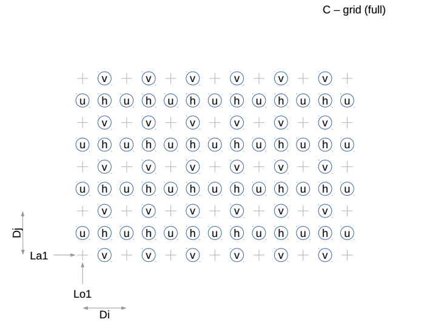
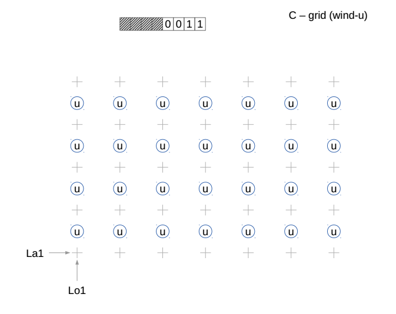
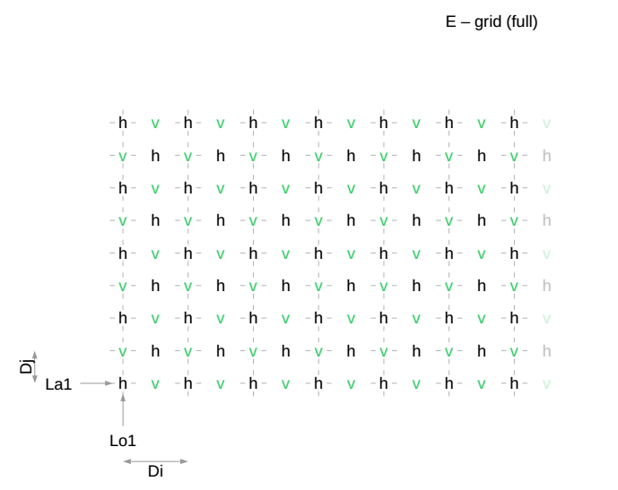
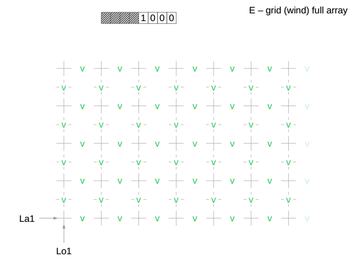

ATTACHMENT II

ARAKAWA GRIDS

Arakawa grids were first described in Arakawa and Lamb (1977).[^1] There are several different grids with unique staggers labelled as A, B, C, D and E. The following examples show how many of these grids can be defined in GRIB2 using grid definition template 3.1 along with bits 5 through 8 of Flag table 3.4. The relevant bit settings are noted where applicable.

**\
**{width="6.499305555555556in" height="5.073611111111111in"}{width="6.499305555555556in" height="4.815277777777778in"}**\
**{width="6.499305555555556in" height="4.836111111111111in"}{width="6.499305555555556in" height="4.861111111111111in"}**\
**{width="6.499305555555556in" height="4.871527777777778in"}{width="6.499305555555556in" height="4.893055555555556in"}**\
**{width="6.499305555555556in" height="5.156944444444444in"}{width="6.499305555555556in" height="4.871527777777778in"}**\
**{width="6.499305555555556in" height="4.923611111111111in"}{width="6.499305555555556in" height="5.159722222222222in"}**\
**{width="6.499305555555556in" height="4.710416666666666in"}{width="6.499305555555556in" height="4.607638888888889in"}**\
**{width="6.499305555555556in" height="4.626388888888889in"}

[^1]: Arakawa, A. and V.R. Lamb, 1977: Computational design of the basic dynamical processes of the UCLA general circulation model. *Methods of Computational Physics* 17*,* New York: Academic Press, pp. 173--265.
